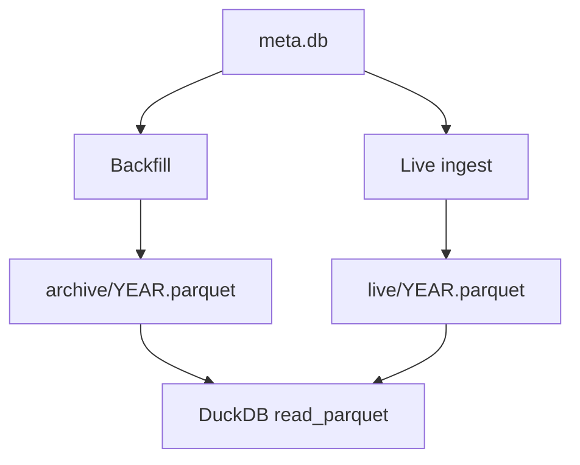

# Chapter 08 — Data Layout

| Field | Value |
|-------|-------|
| **Package** | vinu-stock-price |
| **Module** | `vinu_stock/storage/paths.py` |
| **Status** | REVIEW |
| **Verified** | 2026-07-01 |
| **Prerequisites** | Chapter 01, Chapter 02 |

## Learning objectives

- Navigate the on-disk tree under `VINU_STOCK_DATA_ROOT`.
- Distinguish archive vs live Parquet paths and when each is written.
- Use `parquet_globs()` to build DuckDB read patterns.

## 1. Problem this module solves

OHLCV data spans years of history plus a rolling live append. A flat file per symbol would be unwieldy; separate concerns need clear paths. vinu-stock-price stores **1m bars only** under a predictable hierarchy: `data/prices/1m/{SYMBOL}/archive/` for frozen years and `live/` for the current append stream, plus `meta.db` for catalog state.

## 2. Position in pipeline



| Step | Input | Output |
|------|-------|--------|
| Backfill year job | symbol, year | `archive/{year}.parquet` |
| Live cycle | new closed bars | `live/{current_year}.parquet` |
| Query | symbol | Globs over archive + live |
| Settings | `data_root` | Path prefix for all above |

## 3. File map

| File | Responsibility |
|------|----------------|
| `storage/paths.py` | `prices_root`, `archive_year_path`, `live_year_path`, `parquet_globs` |
| `storage/parquet.py` | Read/write Parquet at resolved paths |
| `catalog/schema.sql` | `archive_through`, `live_file` columns |
| `config.py` | `VINU_STOCK_DATA_ROOT` default `./data` |
| `storage/backend.py` | Opens `meta.db` beside data root |

## 4. Data contracts

### Input

| Field | Type | Required | Example |
|-------|------|----------|---------|
| `data_root` | Path | yes | `./data` or `/data` in Docker |
| `symbol` | string | yes | `AAPL` (normalized uppercase) |
| `year` | int | yes | `2024` |

### Output

| Field | Type | Example |
|-------|------|---------|
| Archive path | file | `data/prices/1m/AAPL/archive/2024.parquet` |
| Live path | file | `data/prices/1m/AAPL/live/2026.parquet` |
| Meta DB | file | `data/meta.db` |
| Glob list | list[str] | Archive and live `*.parquet` patterns |

## 5. Logic (step by step)

**Directory tree** (not in git; created at runtime):

```
{VINU_STOCK_DATA_ROOT}/
├── meta.db
└── prices/1m/{SYMBOL}/
    ├── archive/{YYYY}.parquet
    └── live/{YYYY}.parquet
```

1. **`prices_root(data_root)`** → `{data_root}/prices/1m`.
2. **`symbol_dir(data_root, symbol)`** → `{prices_root}/{SYMBOL.upper()}`.
3. **`archive_year_path(data_root, symbol, year)`** → `.../archive/{year}.parquet`.
4. **`live_year_path(data_root, symbol, year)`** → `.../live/{year}.parquet`.
5. **`parquet_globs(data_root, symbol)`** — if `archive/` exists, add `archive/*.parquet`; if `live/` exists, add `live/*.parquet`. Returns empty list if symbol dir missing.
6. **Backfill** writes only to `archive/`.
7. **Live ingest** appends to `live/{current_utc_year}.parquet` and sets `symbol_catalog.live_file`.
8. **Query engine** unions all globs via DuckDB `read_parquet([...], union_by_name=true)`.

**Year-end rollover** (archive frozen year, continue live) is documented as a fast-follow; v1 does not auto-move live → archive at calendar boundary.

## 6. Configuration

| Key | YAML/env | Default | Effect |
|-----|----------|---------|--------|
| `VINU_STOCK_DATA_ROOT` | env | `./data` | Root for `prices/` and default `meta.db` |
| `VINU_STOCK_META_DB_PATH` | env | `{data_root}/meta.db` | Catalog location |
| `data_root` (settings PATCH) | HTTP/DB | env default | Runtime override via `MetaBackend` |

## 7. Worked examples

### Example A — happy path (inspect tree after backfill)

```bash
vinu-stock-backfill AAPL --from-year 2024 --to-year 2024
ls -la data/prices/1m/AAPL/archive/
# 2024.parquet
```

### Example B — edge case (DuckDB ad-hoc inspect)

```bash
duckdb -c "SELECT symbol, bar_ts, open, close FROM read_parquet('data/prices/1m/AAPL/archive/*.parquet') LIMIT 5"
```

### Example C — Python path helpers

```python
from pathlib import Path
from vinu_stock.storage.paths import archive_year_path, live_year_path

root = Path("./data")
print(archive_year_path(root, "aapl", 2024))
print(live_year_path(root, "AAPL", 2026))
# data/prices/1m/AAPL/archive/2024.parquet
# data/prices/1m/AAPL/live/2026.parquet
```

## 8. API / CLI (if applicable)

| Method | Path / Command | Params | Response |
|--------|----------------|--------|----------|
| GET | `/health` | — | `data_root`, `meta_db` paths |
| GET | `/settings` | — | `data_root` string |
| PATCH | `/settings` | `data_root` | Updates persisted settings |
| — | `vinu-stock-backfill --data-root ./mydata` | CLI override | Writes under `./mydata` |

## 9. SQL / queries (if applicable)

```sql
SELECT symbol, archive_through, live_file, last_bar_ts
FROM symbol_catalog
WHERE symbol = 'AAPL';
```

## 10. Tests

| Test file | Asserts |
|-----------|---------|
| `tests/test_parquet_io.py` | Write/read under temp paths |
| `tests/test_api.py` | Query with sample parquet in temp data root |

## 11. Troubleshooting

| Symptom | Likely cause | Fix |
|---------|--------------|-----|
| No `prices/` directory | No backfill/ingest yet | Run backfill or ingest |
| Query returns empty | Wrong `data_root` in settings | `GET /settings`, align with CLI `--data-root` |
| Duplicate bars across files | Overlap in archive+live | Dedup at write; query may see both until merged |

## 12. Fincept / reference repo mapping

| vinu-stock-price | Reference |
|------------------|-----------|
| Parquet archive/live split | Common quant data lake pattern |
| Single interval on disk | Fincept stores per-broker; v1 stores one normalized schema |
| `meta.db` | vinu-news SQLite catalog analog |

## 13. Related chapters

- [Chapter 09 — BarRecord Model](ch09-bar-record-model.md)
- [Chapter 11 — Parquet I/O](ch11-parquet-io.md)
- [Chapter 10 — Catalog Schema](ch10-catalog-schema.md)
- [Chapter 17 — Query Engine](../part-4-query/ch17-query-engine.md)
