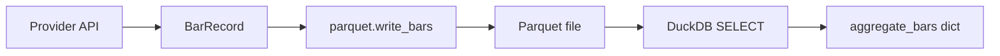

# Chapter 09 — BarRecord Model

| Field | Value |
|-------|-------|
| **Package** | vinu-stock-price |
| **Module** | `vinu_stock/storage/models.py` |
| **Status** | REVIEW |
| **Verified** | 2026-07-01 |
| **Prerequisites** | Chapter 08 |

## Learning objectives

- List every field on `BarRecord` and its semantics.
- Explain the deduplication key used on Parquet writes.
- Serialize and deserialize bars with `to_dict()` / `from_dict()`.

## 1. Problem this module solves

Providers return heterogeneous API payloads. Storage and query need one **canonical row shape** aligned with Fincept `BrokerCandle` plus metadata (`provider`, `adj_factor`). `BarRecord` is the frozen dataclass used from provider fetch through Parquet columns to aggregation input.

## 2. Position in pipeline



| Step | Input | Output |
|------|-------|--------|
| Provider parse | JSON/CSV from vendor | `list[BarRecord]` |
| `to_dict()` | BarRecord | Column-oriented dict for PyArrow |
| `from_dict()` | Parquet row | BarRecord |
| Dedup | combined bars | Unique `(symbol, provider, bar_ts)` |

## 3. File map

| File | Responsibility |
|------|----------------|
| `storage/models.py` | `BarRecord` dataclass |
| `storage/parquet.py` | `_BAR_FIELDS`, `_dedupe_bars`, read/write |
| `providers/polygon.py` | Constructs BarRecord from Polygon response |
| `providers/alpaca.py` | Constructs BarRecord from Alpaca bars |
| `providers/yahoo.py` | Sets `adj_factor` for split-adjusted data |
| `query/aggregate.py` | Consumes bar dicts (subset of fields) |

## 4. Data contracts

### Input

| Field | Type | Required | Example |
|-------|------|----------|---------|
| `symbol` | str | yes | `AAPL` |
| `provider` | str | yes | `polygon` |
| `bar_ts` | int | yes | `1704067200` |
| `open`, `high`, `low`, `close` | float | yes | OHLC prices |
| `volume` | float | yes | `1234567.0` |
| `vwap` | float | no (default `0.0`) | Volume-weighted average |
| `trades` | int | no (default `0`) | Trade count |
| `adj_factor` | float | no (default `1.0`) | Split adjustment multiplier |

### Output

| Field | Type | Example |
|-------|------|---------|
| Parquet columns | 11 fields | Same names as dataclass fields |
| Dedup key | tuple | `("AAPL", "polygon", 1704067200)` |
| Query dict | subset | `symbol`, `provider`, `bar_ts`, OHLCV, `adj_factor` |

**`bar_ts` semantics:** UTC epoch **seconds** at the **open** of the 1-minute bar (not close, not milliseconds).

## 5. Logic (step by step)

1. **`@dataclass(frozen=True)`** — bars are immutable value objects.
2. **`to_dict()`** — `dataclasses.asdict(self)` for PyArrow table build.
3. **`from_dict(data)`** — required keys: `symbol`, `provider`, `bar_ts`, OHLCV; optional `vwap`, `trades`, `adj_factor` default to `0.0`, `0`, `1.0`.
4. **Parquet schema** (`parquet.py` `_BAR_FIELDS`):

| Column | Arrow type |
|--------|------------|
| symbol, provider | string |
| bar_ts, trades | int64 |
| open, high, low, close, volume, vwap, adj_factor | float64 |

5. **`_dedupe_bars`** — dict keyed by `(symbol, provider, bar_ts)`; last write wins; sorted by `bar_ts` on output.
6. **Adjusted prices** — stored raw; `adj_factor` applied at query time when `adjusted=true` (see query indicators module).

## 6. Configuration

| Key | YAML/env | Default | Effect |
|-----|----------|---------|--------|
| — | — | — | BarRecord has no runtime config |
| `adjusted` query param | HTTP/CLI | `false` | Multiplies OHLC by `adj_factor` at read time |

## 7. Worked examples

### Example A — happy path (construct and round-trip)

```python
from vinu_stock.storage.models import BarRecord

bar = BarRecord(
    symbol="AAPL",
    provider="polygon",
    bar_ts=1704067200,
    open=185.0,
    high=185.5,
    low=184.9,
    close=185.2,
    volume=10000.0,
    vwap=185.1,
    trades=42,
)
d = bar.to_dict()
restored = BarRecord.from_dict(d)
assert restored == bar
```

### Example B — edge case (dedup on merge write)

```python
from pathlib import Path
from vinu_stock.storage import parquet
from vinu_stock.storage.models import BarRecord

path = Path("/tmp/test_bars.parquet")
b1 = BarRecord("AAPL", "yahoo", 1704067200, 1, 2, 0.5, 1.5, 100)
b2 = BarRecord("AAPL", "yahoo", 1704067200, 9, 9, 9, 9, 200)  # same key
parquet.write_bars(path, [b1])
parquet.write_bars(path, [b2], merge=True)
rows = parquet.read_bars(path)
assert len(rows) == 1
assert rows[0].close == 9.0  # later bar wins
```

### Example C — CLI adjusted query

```bash
curl "http://127.0.0.1:8081/candles/AAPL?adjusted=true&days=7&interval=1d"
```

Uses `adj_factor` from stored bars (Yahoo backfill populates non-1.0 values).

## 8. API / CLI (if applicable)

| Method | Path / Command | Params | Response |
|--------|----------------|--------|----------|
| GET | `/candles/{symbol}` | `adjusted=true` | OHLC multiplied by `adj_factor` |
| — | `vinu-stock-query candles AAPL --adjusted` | — | Same adjustment in CLI |

## 9. SQL / queries (if applicable)

DuckDB over Parquet (columns match BarRecord):

```sql
SELECT symbol, provider, bar_ts, open, high, low, close, volume, adj_factor
FROM read_parquet('data/prices/1m/AAPL/archive/2024.parquet')
ORDER BY bar_ts
LIMIT 10;
```

## 10. Tests

| Test file | Asserts |
|-----------|---------|
| `tests/test_parquet_io.py` | Round-trip all fields, dedup behavior |
| `tests/test_indicators.py` | Adjusted price application |

## 11. Troubleshooting

| Symptom | Likely cause | Fix |
|---------|--------------|-----|
| Duplicate bars same minute | Different `provider` values | Expected; filter `provider` on query |
| `adj_factor` always 1.0 | Polygon/Alpaca backfill | Yahoo backfill sets non-1.0 |
| Timestamp off by hours | Local vs UTC confusion | All `bar_ts` are UTC epoch seconds |

## 12. Fincept / reference repo mapping

| vinu-stock-price | Reference |
|------------------|-----------|
| `BarRecord` | Fincept `BrokerCandle` + `provider` metadata |
| `adj_factor` | Split-adjustment support (TASK-S02) |
| `vwap`, `trades` | Optional broker fields preserved in Parquet |

## 13. Related chapters

- [Chapter 08 — Data Layout](ch08-data-layout.md)
- [Chapter 11 — Parquet I/O](ch11-parquet-io.md)
- [Chapter 18 — Aggregation](../part-4-query/ch18-aggregation.md)
