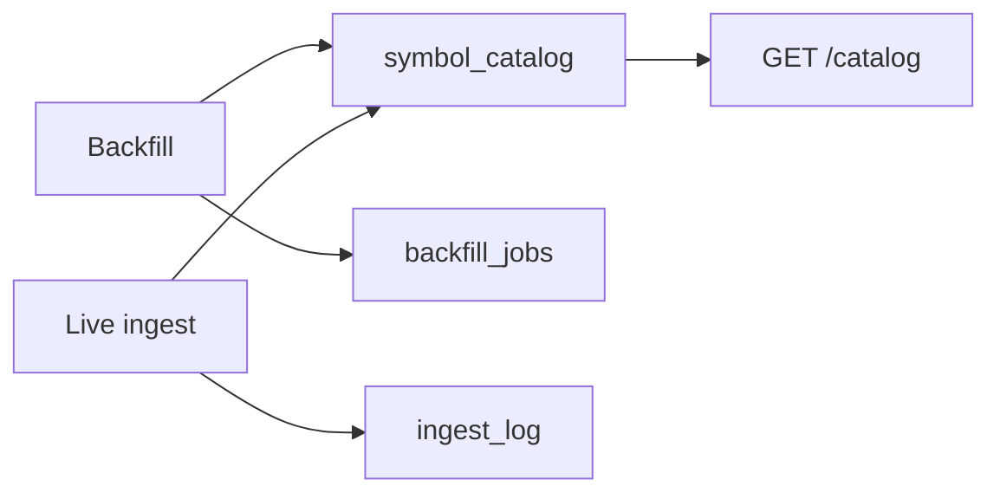

# Chapter 10 — Catalog Schema

| Field | Value |
|-------|-------|
| **Package** | vinu-stock-price |
| **Module** | `vinu_stock/catalog/` |
| **Status** | REVIEW |
| **Verified** | 2026-07-01 |
| **Prerequisites** | Chapter 08, Chapter 09 |

## Learning objectives

- Describe all tables and columns in `catalog/schema.sql`.
- Use `CatalogStore` methods to read and update symbol coverage.
- Interpret `backfill_status`, `backfill_jobs`, and `ingest_log` rows.

## 1. Problem this module solves

Parquet files alone do not answer operational questions: which symbols are covered, what is the bar range, is backfill complete, did live ingest fail? The **catalog** in `meta.db` tracks per-symbol metadata, backfill job state, and ingest audit log. `CatalogStore` is the Python API over `schema.sql`.

## 2. Position in pipeline



| Step | Input | Output |
|------|-------|--------|
| `upsert_symbol` | symbol + metadata | Row in `symbol_catalog` |
| `queue_backfill_job` | symbol, year | Row in `backfill_jobs` |
| `set_job_status` | status, rows, error | Updated job row |
| `log_ingest` | bars_added, ok | Row in `ingest_log` |
| `update_bar_range` | BarRecord list | Merged first/last timestamps |

## 3. File map

| File | Responsibility |
|------|----------------|
| `catalog/schema.sql` | DDL for three tables |
| `catalog/store.py` | `CatalogStore`, `SymbolCatalogEntry` |
| `catalog/gap_validation.py` | `count_session_gaps` for backfill QA |
| `storage/backend.py` | Initializes catalog schema on `MetaBackend` startup |
| `backfill/orchestrator.py` | Writes jobs and status |
| `live/ingest_cycle.py` | Updates range + `ingest_log` |

## 4. Data contracts

### Input

| Field | Type | Required | Example |
|-------|------|----------|---------|
| `symbol` | TEXT | yes | `AAPL` (PK, uppercase) |
| `year` | INTEGER | yes (jobs) | `2024` |
| `backfill_status` | TEXT | no | `pending`, `partial`, `complete` |
| `bars` | list[BarRecord] | for range update | From provider fetch |

### Output

### Table: `symbol_catalog`

| Column | Type | Default | Description |
|--------|------|---------|-------------|
| `symbol` | TEXT PK | — | Ticker |
| `provider` | TEXT | `''` | Last writer provider id |
| `interval` | TEXT | `'1m'` | Stored granularity |
| `first_bar_ts` | INTEGER | null | Earliest bar UTC epoch |
| `last_bar_ts` | INTEGER | null | Latest bar UTC epoch |
| `archive_through` | TEXT | null | Last frozen archive year |
| `live_file` | TEXT | null | Path to current live Parquet |
| `backfill_status` | TEXT | `'pending'` | `pending` \| `partial` \| `complete` |
| `updated_at` | INTEGER | `0` | Last catalog touch epoch |
| `has_adj_data` | INTEGER | `0` | 1 if Yahoo adj_factor data present |
| `gap_count` | INTEGER | `0` | Session gap count from validation |
| `last_validation_at` | INTEGER | null | Last gap check epoch |

### Table: `backfill_jobs`

| Column | Type | Default | Description |
|--------|------|---------|-------------|
| `id` | INTEGER PK AI | — | Job id |
| `symbol` | TEXT | — | Ticker |
| `year` | INTEGER | — | Calendar year |
| `status` | TEXT | `'queued'` | `queued`, `running`, `done`, `failed` |
| `provider` | TEXT | null | Successful provider |
| `rows_written` | INTEGER | `0` | Rows after Parquet merge |
| `error` | TEXT | null | Failure message |
| `updated_at` | INTEGER | `0` | Last update epoch |
| UNIQUE | `(symbol, year)` | — | One job per symbol-year |

### Table: `ingest_log`

| Column | Type | Default | Description |
|--------|------|---------|-------------|
| `id` | INTEGER PK AI | — | Log entry id |
| `symbol` | TEXT | null | Ticker |
| `run_at` | INTEGER | — | Cycle timestamp |
| `bars_added` | INTEGER | `0` | New bars appended |
| `from_ts` | INTEGER | null | Fetch window start |
| `to_ts` | INTEGER | null | Fetch window end |
| `ok` | INTEGER | `1` | 1=success, 0=failure |
| `error` | TEXT | null | Error or gap warning |

## 5. Logic (step by step)

1. **`MetaBackend._init_schema`** executes `schema.sql` via `CatalogStore.init_schema`.
2. **`_migrate_schema`** adds columns `has_adj_data`, `gap_count`, `last_validation_at` if missing (older DBs).
3. **Backfill start** — `upsert_symbol(sym, backfill_status="partial")`.
4. **Per year** — `queue_backfill_job`, `set_job_status(..., "running")`, on success `done` with `rows_written`, on failure `failed` with `error`.
5. **After all years** — `upsert_symbol(sym, backfill_status="complete")`.
6. **`update_bar_range`** — merges min/max `bar_ts` with existing `first_bar_ts`/`last_bar_ts`.
7. **Live ingest** — updates `live_file`, logs to `ingest_log` every symbol per cycle.
8. **`get_catalog()`** — `list_symbols()` or `get_symbol()` → `to_dict()` for API.

## 6. Configuration

| Key | YAML/env | Default | Effect |
|-----|----------|---------|--------|
| `VINU_STOCK_META_DB_PATH` | env | `{data_root}/meta.db` | SQLite file location |
| Index `idx_backfill_jobs_status` | SQL | on `status` | Faster pending job queries |

## 7. Worked examples

### Example A — happy path (API catalog)

```bash
curl http://127.0.0.1:8081/catalog/AAPL
```

```json
{
  "count": 1,
  "data": [{
    "symbol": "AAPL",
    "provider": "polygon",
    "interval": "1m",
    "first_bar_ts": 1704067200,
    "last_bar_ts": 1735689600,
    "archive_through": "2024",
    "live_file": "data/prices/1m/AAPL/live/2026.parquet",
    "backfill_status": "complete",
    "has_adj_data": 0,
    "gap_count": 0
  }]
}
```

### Example B — edge case (inspect failed jobs)

```bash
sqlite3 data/meta.db "SELECT symbol, year, status, error FROM backfill_jobs WHERE status='failed'"
```

### Example C — Python catalog store

```python
from pathlib import Path
from vinu_stock.catalog.store import CatalogStore, open_catalog_db

conn = open_catalog_db(Path("data/meta.db"))
store = CatalogStore(conn)
for entry in store.list_symbols():
    print(entry.symbol, entry.backfill_status, entry.gap_count)
```

## 8. API / CLI (if applicable)

| Method | Path / Command | Params | Response |
|--------|----------------|--------|----------|
| GET | `/catalog` | — | `DataResponse` all symbols |
| GET | `/catalog/{symbol}` | symbol | Single symbol or 404 |
| — | `vinu-stock-query catalog` | — | JSON list |

## 9. SQL / queries (if applicable)

```sql
-- Coverage summary
SELECT symbol, backfill_status,
       datetime(first_bar_ts, 'unixepoch') AS first_bar,
       datetime(last_bar_ts, 'unixepoch') AS last_bar
FROM symbol_catalog;

-- Pending backfill work
SELECT * FROM backfill_jobs WHERE status IN ('queued', 'failed');

-- Live ingest health (last 24h)
SELECT symbol, bars_added, datetime(run_at, 'unixepoch') AS run_at, error
FROM ingest_log
WHERE run_at > strftime('%s', 'now') - 86400
ORDER BY id DESC;
```

## 10. Tests

| Test file | Asserts |
|-----------|---------|
| `tests/test_catalog.py` | upsert, jobs, ingest log |
| `tests/test_gap_validation.py` | `gap_count` population |
| `tests/test_api.py` | `/catalog` routes |

## 11. Troubleshooting

| Symptom | Likely cause | Fix |
|---------|--------------|-----|
| Symbol not in catalog | No backfill/ingest yet | Run backfill or ingest |
| `backfill_status=complete` but gaps | `gap_count > 0` logged | Check `ingest_log` gap_warning |
| Stale `last_bar_ts` | Live ingest not running | Start `vinu-stock-ingest --continuous` |

## 12. Fincept / reference repo mapping

| vinu-stock-price | Reference |
|------------------|-----------|
| `symbol_catalog` | Per-instrument metadata registry |
| `backfill_jobs` | Batch job tracking (similar to news ingestion queues) |
| `meta.db` | vinu-news `analysis/storage` catalog pattern |

## 13. Related chapters

- [Chapter 08 — Data Layout](ch08-data-layout.md)
- [Chapter 13 — Backfill Flow](../part-3-ingest/ch13-backfill-flow.md)
- [Chapter 14 — Live Ingest](../part-3-ingest/ch14-live-ingest.md)
- [Chapter 21 — HTTP API](../part-5-operations/ch21-http-api.md)
