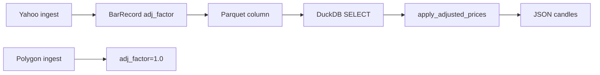

# Chapter 12 — Adjusted Close & Split Factors

| Field | Value |
|-------|-------|
| **Package** | vinu-stock-price |
| **Module** | `vinu_stock/storage/models.py`, `vinu_stock/query/indicators.py` |
| **Status** | REVIEW |
| **Verified** | 2026-07-01 |
| **Prerequisites** | Chapter 09, Chapter 11 |

## Learning objectives

- Explain `BarRecord.adj_factor` storage and when it differs from `1.0`.
- Apply `apply_adjusted_prices` at query time (TASK-S02).
- Interpret `symbol_catalog.has_adj_data` after Yahoo backfill.

## 1. Problem this module solves

Raw OHLC prices are wrong for long-horizon return studies after **splits and dividends**. v1 stores an optional **`adj_factor`** per bar (ratio of adjusted close to close on ingest) and applies it **on read** when `adjusted=true`. Polygon returns pre-adjusted OHLC (`adjusted=true` API flag) but does not persist a separate factor; Yahoo computes `adj_factor` from `adjclose` in `_parse_yahoo_chart`.

## 2. Position in pipeline



| Step | Input | Output |
|------|-------|--------|
| Ingest (Yahoo) | `adjclose / close` | `adj_factor` on `BarRecord` |
| Parquet write | all fields | `adj_factor` column (default 1.0) |
| Query `adjusted=false` | raw OHLC | Unmodified prices |
| Query `adjusted=true` | OHLC × factor | Split-adjusted series |

## 3. File map

| File | Responsibility |
|------|----------------|
| `storage/models.py` | `BarRecord.adj_factor` field, `from_dict` default `1.0` |
| `providers/yahoo.py` | Computes `adj_factor` per bar |
| `providers/polygon.py` | API `adjusted=true`; factor stays `1.0` |
| `query/indicators.py` | `apply_adjusted_prices` (TASK-S02) |
| `query/engine.py` | `COALESCE(adj_factor, 1.0)` in SQL; calls apply when `adjusted` |
| `backfill/year_job.py` | Sets `has_adj_data` when Yahoo factors ≠ 1 |
| `catalog/schema.sql` | `has_adj_data INTEGER` on `symbol_catalog` |

## 4. Data contracts

### Input

| Field | Type | Required | Example |
|-------|------|----------|---------|
| `adj_factor` | float | no (default 1.0) | `0.25` after 4:1 split |
| `adjusted` query flag | bool | no | `true` via API/CLI |
| Yahoo `adjclose` | float | on Yahoo bars | Used only at parse time |

### Output

| Field | Type | Example |
|-------|------|---------|
| Scaled `open/high/low/close` | float | `100.0 * 0.5 = 50.0` |
| Unscaled volume | float | Volume not adjusted in v1 |
| `has_adj_data` | int (catalog) | `1` if any Yahoo factor ≠ 1 in backfill year |

## 5. Logic (step by step)

1. **`BarRecord`** — `adj_factor: float = 1.0`; serialized to Parquet via `to_dict()`.
2. **Yahoo parse** — `adj_factor = adjclose[i] / close[i]` when both present and `close != 0`; else `1.0`.
3. **Polygon** — prices already split-adjusted from API; factor not derived; stored as `1.0`.
4. **DuckDB read** — `SELECT ... COALESCE(adj_factor, 1.0) AS adj_factor`.
5. **`apply_adjusted_prices(rows)`** — for each row, if `factor != 1.0`, multiply `open`, `high`, `low`, `close` by factor; volume unchanged.
6. **Order in pipeline** — aggregate to coarser interval first, then adjust, then indicators (see `fetch_candles` in `engine.py`).
7. **Catalog** — `run_year_job` sets `has_adj_data=1` when `provider_id == "yahoo"` and any `b.adj_factor != 1.0`.

## 6. Configuration

| Key | YAML/env | Default | Effect |
|-----|----------|---------|--------|
| `adjusted` | API query | `false` | Enable `apply_adjusted_prices` |
| `--adjusted` | CLI | off | Same for `vinu-stock-query candles` |
| Polygon `adjusted=true` | API param | always on | Vendor-side adjustment |

## 7. Worked examples

### Example A — happy path (adjusted query)

```bash
vinu-stock-query candles AAPL --days 30 --adjusted
curl "http://127.0.0.1:8081/candles/AAPL?days=30&adjusted=true"
```

OHLC values reflect `adj_factor` when stored (typically Yahoo-sourced rows).

### Example B — edge case (factor 0.5)

```python
from vinu_stock.query.indicators import apply_adjusted_prices

rows = [{"open": 100.0, "high": 110.0, "low": 90.0, "close": 100.0, "adj_factor": 0.5}]
out = apply_adjusted_prices(rows)
assert out[0]["close"] == 50.0
```

Matches `tests/test_indicators.py::test_apply_adjusted_prices`.

### Example C — catalog flag after Yahoo backfill

```sql
SELECT symbol, has_adj_data, provider
FROM symbol_catalog
WHERE symbol = 'AAPL';
```

`has_adj_data=1` indicates non-unity factors exist in ingested Yahoo data for that symbol.

## 8. API / CLI (if applicable)

| Method | Path / Command | Params | Response |
|--------|----------------|--------|----------|
| GET | `/candles/{symbol}` | `adjusted=true` | Scaled OHLC |
| — | `vinu-stock-query candles` | `--adjusted` | JSON to stdout |
| `StockService.get_candles` | Python | `adjusted=True` | Same pipeline |

## 9. SQL / queries (if applicable)

```sql
-- Inspect factors in Parquet directly
SELECT bar_ts,
       close,
       adj_factor,
       close * adj_factor AS adj_close_manual
FROM read_parquet('data/prices/1m/AAPL/archive/2024.parquet')
WHERE adj_factor != 1.0
ORDER BY bar_ts
LIMIT 20;
```

## 10. Tests

| Test file | Asserts |
|-----------|---------|
| `tests/test_indicators.py` | `test_apply_adjusted_prices` |
| `tests/test_providers_mock.py` | Yahoo `adj_factor` in parser fixture |

## 11. Troubleshooting

| Symptom | Likely cause | Fix |
|---------|--------------|-----|
| `adjusted=true` looks identical | All `adj_factor=1.0` (Polygon-only data) | Backfill via Yahoo or accept Polygon pre-adjusted OHLC |
| `has_adj_data=0` after Yahoo | No splits in year range | Expected for stable periods |
| Double adjustment | Polygon OHLC already adjusted + `adjusted=true` | Prefer `adjusted=false` for Polygon-only series or document vendor mix |

## 12. Fincept / reference repo mapping

| vinu-stock-price | Reference |
|------------------|-----------|
| `adj_factor` column | qlib / FinRL adjusted price conventions (simplified) |
| Query-time adjust | Avoids rewriting historical Parquet on corporate actions |
| TASK-S02 | Enhancement-doc1 adjusted close deliverable |

## 13. Related chapters

- [Chapter 07 — Yahoo Fallback](../part-1-providers/ch07-yahoo-fmp-fallback.md)
- [Chapter 09 — BarRecord Model](ch09-bar-record-model.md)
- [Chapter 17 — Query Engine](../part-4-query/ch17-query-engine.md)
- [Chapter 19 — Indicators](../part-4-query/ch19-indicators.md)
