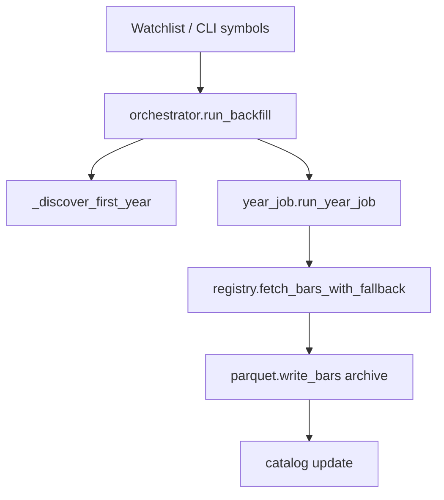

# Chapter 13 — Backfill Flow

| Field | Value |
|-------|-------|
| **Package** | vinu-stock-price |
| **Module** | `vinu_stock/backfill/` |
| **Status** | REVIEW |
| **Verified** | 2026-07-01 |
| **Prerequisites** | Chapter 03, Chapter 04, Chapter 10, Chapter 11 |

## Learning objectives

- Trace the backfill orchestrator from symbol list through year jobs to catalog updates.
- Explain automatic first-year discovery via `earliest_available()`.
- Run backfill via CLI and HTTP trigger with year overrides.

## 1. Problem this module solves

New watchlist symbols need **historical 1m bars** before live ingest and queries are useful. Backfill fetches calendar years from providers in priority order, writes **archive Parquet**, tracks jobs in `backfill_jobs`, and sets `symbol_catalog.backfill_status`. Heavy work is split into **one year per job** for retryability.

## 2. Position in pipeline



| Step | Input | Output |
|------|-------|--------|
| Discover years | symbol, optional from/to | Year range start..end |
| Queue job | symbol, year | `backfill_jobs` row |
| Year fetch | UTC year bounds | Provider bars |
| Write | bars | `archive/{year}.parquet` |
| Finalize | all years | `backfill_status=complete` |

## 3. File map

| File | Responsibility |
|------|----------------|
| `backfill/orchestrator.py` | `run_backfill`, `BackfillSummary`, year loop |
| `backfill/year_job.py` | Single-year fetch, write, gap validation |
| `service.py` | `StockService.run_backfill` |
| `cli.py` | `vinu-stock-backfill` |
| `server/routes_config.py` | `POST /backfill/trigger` |
| `catalog/gap_validation.py` | Session gap counting after year write |

## 4. Data contracts

### Input

| Field | Type | Required | Example |
|-------|------|----------|---------|
| `symbols` | list[str] | yes (or watchlist default) | `["AAPL"]` |
| `from_year` | int \| null | no | `2020` (auto if null) |
| `to_year` | int \| null | no | `2025` (default: last complete year) |
| `data_root` | Path | yes | From settings |

### Output

| Field | Type | Example |
|-------|------|---------|
| `BackfillSummary.years_ok` | int | `5` |
| `BackfillSummary.total_rows` | int | Parquet row count sum |
| Archive file | parquet | `archive/2024.parquet` |
| Catalog | DB | `archive_through`, `gap_count`, `has_adj_data` |

## 5. Logic (step by step)

**Orchestrator (`run_backfill`):**

1. Uppercase symbols; return empty summary if none.
2. `end_year = to_year or (current_utc_year - 1)`; cap at current year.
3. Per symbol:
   - `catalog.upsert_symbol(sym, backfill_status="partial")`.
   - `start_year = from_year or _discover_first_year(sym, registry)` — tries `for_role("backfill")` providers' `earliest_available()`, then Yahoo.
   - If `start_year > end_year`, mark `complete` and skip.
   - For each `year` in `range(start_year, end_year + 1)`:
     - `queue_backfill_job`, `set_job_status(..., "running")`.
     - Call `run_year_job`.
     - On success: `set_job_status(..., "done", provider, rows_written)`.
     - On failure: `set_job_status(..., "failed", error=err)`.
   - `upsert_symbol(sym, backfill_status="complete")`.

**Year job (`run_year_job`):**

1. UTC window: `[Jan 1 year, Jan 1 year+1 - 1s]`, clipped to now.
2. `registry.fetch_bars_with_fallback(sym, start_ts, end_ts, role="backfill")`.
3. `parquet.write_bars(archive_year_path(...), bars, merge=True)`.
4. `catalog.update_bar_range`, set `archive_through`, `has_adj_data` (Yahoo adj), `gap_count` via `count_session_gaps`.
5. If gaps > 0, log warning to `ingest_log`.

## 6. Configuration

| Key | YAML/env | Default | Effect |
|-----|----------|---------|--------|
| `providers.yaml` | YAML | polygon first | Backfill provider order |
| `POLYGON_API_KEY` | env | — | Deep history |
| CLI `--from-year` / `--to-year` | CLI | auto | Year bounds |
| `POST /backfill/trigger` | HTTP | watchlist | No year args — full auto range |

## 7. Worked examples

### Example A — happy path (single year test)

```bash
vinu-stock-query watchlist AAPL
vinu-stock-backfill AAPL --from-year 2024 --to-year 2024 --verbose
```

Expected output includes `Years OK: 1`, `Total rows written: N`.

### Example B — edge case (all watchlist, auto years)

```bash
vinu-stock-backfill
```

Uses watchlist symbols; discovers first year per symbol; ends at last complete calendar year.

### Example C — HTTP trigger

```bash
curl -X POST http://127.0.0.1:8081/backfill/trigger
```

```json
{
  "ok": true,
  "summary": {
    "years_ok": 2,
    "years_failed": 0,
    "total_rows": 98234
  }
}
```

### Example D — Docker manual backfill

```bash
docker compose run --rm api vinu-stock-backfill AAPL --from-year 2023 --to-year 2024
```

## 8. API / CLI (if applicable)

| Method | Path / Command | Params | Response |
|--------|----------------|--------|----------|
| — | `vinu-stock-backfill [SYMBOL...]` | `--from-year`, `--to-year`, `--verbose` | Text `BackfillSummary` |
| — | `vinu-stock-backfill --data-root ./mydata` | path overrides | Custom data root |
| POST | `/backfill/trigger` | — | `TriggerResponse` with year stats |

## 9. SQL / queries (if applicable)

```sql
SELECT symbol, year, status, provider, rows_written, error
FROM backfill_jobs
WHERE symbol = 'AAPL'
ORDER BY year;

SELECT symbol, archive_through, backfill_status, gap_count
FROM symbol_catalog
WHERE symbol = 'AAPL';
```

## 10. Tests

| Test file | Asserts |
|-----------|---------|
| `tests/test_providers_mock.py` | Mocked provider fetch in backfill path |
| `tests/test_catalog.py` | Job status transitions |
| `tests/test_gap_validation.py` | Gap warnings on sparse data |

## 11. Troubleshooting

| Symptom | Likely cause | Fix |
|---------|--------------|-----|
| All years failed | No API keys | Set Polygon/Alpaca or use Yahoo for recent years |
| `future year skipped` | to_year in future | Use `to_year <= current_year - 1` for full years |
| High `gap_count` | Provider missing session minutes | Expected for thin free data; check `ingest_log` |
| Slow backfill | Many symbols × many years | Scope `--from-year`/`--to-year`; run per symbol |

## 12. Fincept / reference repo mapping

| vinu-stock-price | Reference |
|------------------|-----------|
| Year-partitioned archive | Common historical bar storage |
| Job table | Batch ETL job tracking |
| vinu-news orchestration | Similar ingest orchestration pattern |

## 13. Related chapters

- [Chapter 03 — Provider Architecture](../part-1-providers/ch03-provider-architecture.md)
- [Chapter 10 — Catalog Schema](../part-2-storage/ch10-catalog-schema.md)
- [Chapter 11 — Parquet I/O](../part-2-storage/ch11-parquet-io.md)
- [Chapter 14 — Live Ingest](ch14-live-ingest.md)
- [Chapter 22 — CLI Reference](../part-5-operations/ch22-cli-reference.md)
