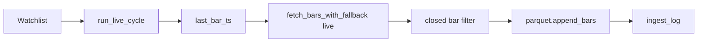

# Chapter 14 — Live Ingest

| Field | Value |
|-------|-------|
| **Package** | vinu-stock-price |
| **Module** | `vinu_stock/live/` |
| **Status** | REVIEW |
| **Verified** | 2026-07-01 |
| **Prerequisites** | Chapter 03, Chapter 10, Chapter 11, Chapter 13 |

## Learning objectives

- Describe one live ingest cycle: overlap window, closed-bar filter, append path.
- Run ingest once, continuously, or via HTTP/Docker.
- Diagnose zero-bar cycles using `ingest_log`.

## 1. Problem this module solves

Historical backfill does not keep data current. **Live ingest** polls watchlist symbols on an interval, fetches new **closed** 1m bars from live-role providers, appends to `live/{current_year}.parquet`, and updates `symbol_catalog.last_bar_ts`. Overlap and closed-bar rules prevent gaps and partial-minute pollution.

## 2. Position in pipeline



| Step | Input | Output |
|------|-------|--------|
| Load state | `symbol_catalog.last_bar_ts` | `start_ts` with overlap |
| Fetch | `start_ts` .. `now` | Raw bars from provider |
| Filter | `now_ts` | Bars with `bar_ts + 60 <= now` |
| Append | new bars | `live/{year}.parquet` |
| Log | per symbol | `ingest_log` row |

## 3. File map

| File | Responsibility |
|------|----------------|
| `live/ingest_cycle.py` | `run_live_cycle`, `LiveIngestSummary`, `OVERLAP_SEC=180` |
| `service.py` | `StockService.run_live_cycle` |
| `cli.py` | `vinu-stock-ingest` (`--once`, `--continuous`, `--interval`) |
| `server/routes_config.py` | `POST /ingest/trigger` |
| `docker-compose.yml` | `live-ingest` service |

## 4. Data contracts

### Input

| Field | Type | Required | Example |
|-------|------|----------|---------|
| `symbols` | list[str] | yes (or watchlist) | `["AAPL", "NVDA"]` |
| `last_bar_ts` | int \| null | from catalog | `1735689540` |
| `OVERLAP_SEC` | constant | 180 | Re-fetch window behind last bar |
| `now_ts` | int | `time.time()` | Cycle timestamp |

### Output

| Field | Type | Example |
|-------|------|---------|
| `LiveIngestSummary.bars_added` | int | `12` |
| `LiveIngestSummary.symbols_failed` | int | `0` |
| Live parquet | file | `live/2026.parquet` |
| `ingest_log` | row | `bars_added`, `ok`, `error` |

## 5. Logic (step by step)

For each watchlist symbol:

1. **`symbols_polled`** increment; skip empty strings.
2. **Load `last_ts`** from `catalog.get_symbol(sym).last_bar_ts`.
3. **Compute `start_ts`**:
   - If `last_ts`: `last_ts - OVERLAP_SEC` (180s overlap).
   - Else: `now_ts - 24*3600` (cold start: last 24h).
4. **`registry.fetch_bars_with_fallback(sym, start_ts, now_ts, role="live")`**.
   - On failure: increment `symbols_failed`, `log_ingest(..., ok=False)`, continue.
5. **Trim overlap duplicates**: if `last_ts`, keep bars with `bar_ts > last_ts - OVERLAP_SEC`.
6. **`_filter_closed_bars`**: keep only `bar_ts + 60 <= now_ts` (minute fully closed).
7. If no new bars: `log_ingest(..., bars_added=0, ok=True)`; continue.
8. **`parquet.append_bars(live_year_path(data_root, sym, current_utc_year), new_bars)`**.
9. **`catalog.update_bar_range`** with `live_file` path set.
10. **`log_ingest`** success with bar count and min/max `bar_ts`.

**CLI continuous mode:** loop `run_cycle()`, sleep `poll_interval_sec` from settings (default 60).

## 6. Configuration

| Key | YAML/env | Default | Effect |
|-----|----------|---------|--------|
| `VINU_STOCK_POLL_INTERVAL_SEC` | env | `60` | Sleep between continuous cycles |
| `providers.yaml` live roles | YAML | polygon, alpaca | Live fetch order |
| Docker `live-ingest` command | compose | `--interval 60` | Container poll rate |
| Settings `poll_interval_sec` | DB/API | env default | Runtime interval for `--continuous` |

## 7. Worked examples

### Example A — happy path (single cycle)

```bash
vinu-stock-query watchlist AAPL
vinu-stock-backfill AAPL --from-year 2024 --to-year 2024
vinu-stock-ingest --once
```

Sample output:

```
Watchlist: 1 tickers
Symbols polled: 1
Bars added: 3
Symbols failed: 0
```

### Example B — edge case (market closed — zero bars normal)

```bash
vinu-stock-ingest --once --verbose
sqlite3 data/meta.db "SELECT symbol, bars_added, ok, error FROM ingest_log ORDER BY id DESC LIMIT 5"
```

Off-hours often show `bars_added=0` with `ok=1` — not an error.

### Example C — HTTP trigger

```bash
curl -X POST http://127.0.0.1:8081/ingest/trigger
```

```json
{
  "ok": true,
  "summary": {
    "bars_added": 5,
    "symbols_polled": 2,
    "watchlist_size": 2
  }
}
```

### Example D — continuous with custom interval

```bash
vinu-stock-ingest --interval 120
```

Polls every 120 seconds (uses explicit interval; loads watchlist each cycle).

## 8. API / CLI (if applicable)

| Method | Path / Command | Params | Response |
|--------|----------------|--------|----------|
| — | `vinu-stock-ingest --once` | — | Text summary |
| — | `vinu-stock-ingest --continuous` | — | Loop until killed |
| — | `vinu-stock-ingest --interval SECONDS` | poll period | Loop with fixed sleep |
| POST | `/ingest/trigger` | — | `TriggerResponse` |

## 9. SQL / queries (if applicable)

```sql
-- Recent ingest activity
SELECT symbol, bars_added,
       datetime(run_at, 'unixepoch') AS run_at,
       datetime(from_ts, 'unixepoch') AS from_ts,
       ok, error
FROM ingest_log
ORDER BY id DESC
LIMIT 20;

-- Catalog live pointer
SELECT symbol, last_bar_ts, live_file FROM symbol_catalog;
```

## 10. Tests

| Test file | Asserts |
|-----------|---------|
| `tests/test_api.py` | `POST /ingest/trigger` |
| `tests/test_providers_mock.py` | Mocked live fetch |
| `tests/test_parquet_io.py` | Append semantics |

## 11. Troubleshooting

| Symptom | Likely cause | Fix |
|---------|--------------|-----|
| `bars_added: 0` always | Market closed / no new closed minutes | Normal off-hours |
| `symbols_failed` > 0 | Provider error | Check `ingest_log.error`; verify API keys |
| Stale prices | Ingest not running | `--continuous` or Docker `live-ingest` |
| Duplicate minutes | Overlap refetch | Deduped on write by `(symbol, provider, bar_ts)` |

## 12. Fincept / reference repo mapping

| vinu-stock-price | Reference |
|------------------|-----------|
| Closed-bar filter | Standard live bar completion rule |
| 180s overlap | Reconciliation window common in tick/bar feeds |
| vinu-news `run_ingestion_cycle` | `StockService.run_live_cycle` analog |

## 13. Related chapters

- [Chapter 13 — Backfill Flow](ch13-backfill-flow.md)
- [Chapter 03 — Provider Architecture](../part-1-providers/ch03-provider-architecture.md)
- [Chapter 11 — Parquet I/O](../part-2-storage/ch11-parquet-io.md)
- [Chapter 23 — Docker](../part-5-operations/ch23-docker.md)
- [Chapter 21 — HTTP API](../part-5-operations/ch21-http-api.md)
