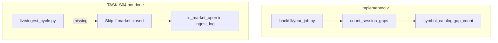

# Chapter 15 — Market Calendar & Session Logic

| Field | Value |
|-------|-------|
| **Package** | vinu-stock-price |
| **Module** | `vinu_stock/catalog/gap_validation.py` (partial); `vinu_stock/live/ingest_cycle.py` |
| **Status** | REVIEW |
| **Verified** | 2026-07-01 |
| **Prerequisites** | Chapter 14, Chapter 16 |
| **Implementation note** | **TASK-S04 partial** — session logic exists for gap counting; live ingest does **not** skip off-hours fetches |

## Learning objectives

- Describe NYSE regular session rules used in `gap_validation.py`.
- Contrast **implemented** gap validation (backfill) with **not implemented** live calendar skip (TASK-S04).
- Explain why live ingest may fetch outside RTH and how closed-bar filter differs.

## 1. Problem this module solves

US equities trade on a **calendar**, not 24×7. Missing bars should be counted only during **regular trading hours** (RTH), not overnight. TASK-S04 targets skipping live append outside NYSE session and logging `is_market_open`. **Current v1 state:**

| Area | Status |
|------|--------|
| `count_session_gaps` in `gap_validation.py` | **Implemented** — used after backfill year jobs |
| Live ingest session skip | **Not implemented** — `ingest_cycle.py` polls regardless of market hours |
| `ingest_log.is_market_open` column | **Not implemented** |
| `pandas_market_calendars` / holidays | **Not implemented** — weekdays + 09:30–16:00 ET only |

## 2. Position in pipeline



| Step | Input | Output |
|------|-------|--------|
| `_in_regular_session(ts)` | UTC epoch | bool (weekday 09:30–16:00 ET) |
| `count_session_gaps(timestamps)` | sorted bar_ts list | Missing 1m slots in RTH |
| `run_live_cycle` (today) | watchlist | Fetches 24h window; **no** calendar gate |
| `_filter_closed_bars` | `now_ts` | Drops incomplete minute only |

## 3. File map

| File | Responsibility |
|------|----------------|
| `catalog/gap_validation.py` | `count_session_gaps`, `_in_regular_session`, NY `ZoneInfo` |
| `backfill/year_job.py` | Runs gap count post-write; logs `gap_warning` |
| `live/ingest_cycle.py` | Live cycle — **no** market calendar import |
| `catalog/schema.sql` | `gap_count`, `last_validation_at` on `symbol_catalog` |

## 4. Data contracts

### Input

| Field | Type | Required | Example |
|-------|------|----------|---------|
| `bar_timestamps` | list[int] | yes | UTC epoch seconds, 1m spacing expected |
| `SESSION_OPEN_MIN` | int | constant | `570` (09:30) |
| `SESSION_CLOSE_MIN` | int | constant | `960` (16:00) |
| `BAR_SEC` | int | constant | `60` |

### Output

| Field | Type | Example |
|-------|------|---------|
| `gap_count` | int | `12` missing RTH minutes |
| `ingest_log.error` | string | `gap_warning: 12 missing session bars in 2024` |
| Live fetch (current) | bars | May include pre/post if provider returns them |

### Session rules (simplified v1)

| Rule | Implemented? | Detail |
|------|--------------|--------|
| Weekdays Mon–Fri | yes | `weekday() < 5` in America/New_York |
| 09:30 ≤ time < 16:00 ET | yes | Minute-of-day check |
| NYSE holidays | **no** | Would need `pandas_market_calendars` |
| Early close days | **no** | Hard close at 16:00 always |
| Live skip when closed | **no** | TASK-S04 |

## 5. Logic (step by step)

**Gap validation (`count_session_gaps`):**

1. Sort unique timestamps; if fewer than 2, return `0`.
2. For each consecutive pair `(prev, curr)` where `prev` is in RTH:
3. Step `expected = prev + 60` while `expected < curr`.
4. If `expected` is in RTH, increment `gap_count`.
5. Return total gaps.

**Backfill hook (`run_year_job`):**

1. After Parquet write, `gap_count = count_session_gaps([b.bar_ts for b in result.bars])`.
2. `catalog.upsert_symbol(..., gap_count=gap_count, last_validation_at=now)`.
3. If `gap_count > 0`, `log_ingest` with `ok=True` and `error=gap_warning: ...`.

**Live ingest (actual behavior):**

1. No call to `gap_validation` or session check.
2. `start_ts` from `last_bar_ts - 180s` or last 24h cold start.
3. Provider may return extended-hours bars; Yahoo uses `includePrePost=false`.
4. `_filter_closed_bars` removes only the **current incomplete minute**, not overnight bars.

## 6. Configuration

| Key | YAML/env | Default | Effect |
|-----|----------|---------|--------|
| — | — | — | No env vars for calendar in v1 |
| TASK-S04 future | — | — | Configurable session + `is_market_open` flag |

## 7. Worked examples

### Example A — happy path (gap count after backfill)

```bash
vinu-stock-backfill AAPL --from-year 2024 --to-year 2024
sqlite3 data/meta.db "SELECT symbol, gap_count, last_validation_at FROM symbol_catalog WHERE symbol='AAPL'"
```

Non-zero `gap_count` means missing RTH minutes detected (provider holes or holidays counted as gaps).

### Example B — edge case (live ingest on Sunday)

```bash
vinu-stock-ingest --once --verbose
```

Cycle still runs; `symbols_polled` increments; `bars_added` often `0` because providers return no new **closed** RTH bars — but this is **not** because code skipped the session; it's because data is empty or filtered by closed-bar rule.

### Example C — unit test session gap

```python
from vinu_stock.catalog.gap_validation import count_session_gaps

# Two RTH timestamps 2 minutes apart → at least 1 gap
ts = [1_704_107_400, 1_704_107_520]  # illustrative UTC instants in session
assert count_session_gaps(ts) >= 1
```

See `tests/test_gap_validation.py`.

## 8. API / CLI (if applicable)

| Method | Path / Command | Params | Response |
|--------|----------------|--------|----------|
| GET | `/catalog/{symbol}` | — | Includes `gap_count` |
| — | `vinu-stock-ingest` | — | No `--market-only` flag (future TASK-S04) |
| POST | `/ingest/trigger` | — | Same live behavior 24/7 |

## 9. SQL / queries (if applicable)

```sql
-- Symbols with gap warnings
SELECT symbol, gap_count,
       datetime(last_validation_at, 'unixepoch') AS validated_at
FROM symbol_catalog
WHERE gap_count > 0;

-- Recent gap warnings in ingest log
SELECT symbol, error, datetime(run_at, 'unixepoch')
FROM ingest_log
WHERE error LIKE 'gap_warning:%'
ORDER BY id DESC;
```

## 10. Tests

| Test file | Asserts |
|-----------|---------|
| `tests/test_gap_validation.py` | Consecutive bars → 0 gaps; missing minute → ≥1 |
| `tests/test_catalog.py` | Catalog upsert with gap fields |

No test for live session skip (feature absent).

## 11. Troubleshooting

| Symptom | Likely cause | Fix |
|---------|--------------|-----|
| High `gap_count` on holiday | Holidays not excluded | Expected v1 limitation; ignore or implement TASK-S04 calendar |
| Live runs overnight | By design | No harm; usually `bars_added=0` |
| False gaps overnight | Gap logic skips non-RTH | Only RTH minutes counted — OK |
| Want skip when closed | TASK-S04 not done | Patch `ingest_cycle.py` or wait for enhancement |

## 12. Fincept / reference repo mapping

| vinu-stock-price | Reference |
|------------------|-----------|
| Simplified NYSE RTH | FinRL-Trading `pandas_market_calendars` (not wired) |
| TASK-S04 spec | `enhancement-doc1.md` § TASK-S04 |
| Gap count vs live skip | Backfill QA only in v1 |

## 13. Related chapters

- [Chapter 16 — Retry and Gap Validation](ch16-retry-gap-validation.md)
- [Chapter 14 — Live Ingest](ch14-live-ingest.md)
- [Chapter 13 — Backfill Flow](ch13-backfill-flow.md)
- [Appendix D — Roadmap](../part-6-appendices/apx-d-roadmap.md)
