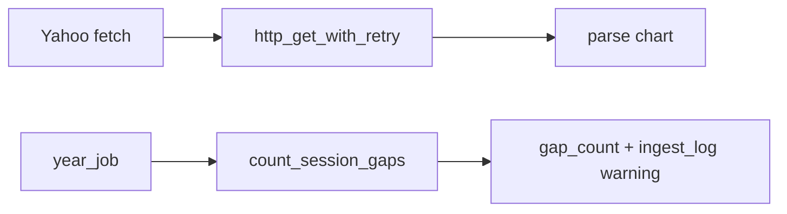

# Chapter 16 — Provider Retry & Gap Validation

| Field | Value |
|-------|-------|
| **Package** | vinu-stock-price |
| **Module** | `vinu_stock/providers/retry.py`, `vinu_stock/catalog/gap_validation.py` |
| **Status** | REVIEW |
| **Verified** | 2026-07-01 |
| **Prerequisites** | Chapter 03, Chapter 10, Chapter 15 |

## Learning objectives

- Configure `retry_on_transient` and `http_get_with_retry` behavior (TASK-S03).
- Run `count_session_gaps` after backfill and interpret catalog fields.
- Trace gap warnings from `year_job` into `ingest_log`.

## 1. Problem this module solves

HTTP providers fail transiently (timeouts, 503, 429). **TASK-S03** adds exponential backoff retries for Yahoo's chart API. Separately, backfill must **detect missing RTH minutes** without treating nights and weekends as gaps — `gap_validation.py` implements that count and persists `gap_count` on `symbol_catalog`.

## 2. Position in pipeline



| Step | Input | Output |
|------|-------|--------|
| `retry_on_transient` | callable | Retries on Timeout/ConnectionError |
| `http_get_with_retry` | URL | Response after ≤3 attempts |
| `count_session_gaps` | bar timestamps | Integer gap count |
| `run_year_job` | fetched bars | Updates catalog + optional warning log |

## 3. File map

| File | Responsibility |
|------|----------------|
| `providers/retry.py` | `retry_on_transient`, `http_get_with_retry` |
| `providers/yahoo.py` | Uses `http_get_with_retry` |
| `catalog/gap_validation.py` | `count_session_gaps`, session helpers |
| `backfill/year_job.py` | Invokes gap count after archive write |
| `catalog/store.py` | `gap_count`, `last_validation_at` columns |

## 4. Data contracts

### Input (retry)

| Field | Type | Required | Example |
|-------|------|----------|---------|
| `n` | int | no | `3` attempts |
| `backoff` | float | no | `1.5` multiplier |
| `exceptions` | tuple | no | `Timeout`, `ConnectionError` |
| HTTP status | int | — | `429, 500, 502, 503, 504` → retry as ConnectionError |

### Output (retry)

| Field | Type | Example |
|-------|------|---------|
| `requests.Response` | object | 200 after 2nd attempt |
| Raised exception | — | After all attempts exhausted |

### Input (gaps)

| Field | Type | Required | Example |
|-------|------|----------|---------|
| `bar_timestamps` | list[int] | yes | All `bar_ts` from year job |

### Output (gaps)

| Field | Type | Example |
|-------|------|---------|
| `gap_count` | int | `5` |
| `ingest_log.error` | string | `gap_warning: 5 missing session bars in 2024` |

## 5. Logic (step by step)

**Retry (`retry.py`):**

1. `retry_on_transient` decorator loops `attempt` 1..`n`.
2. On configured exceptions, log warning, `sleep(delay)`, `delay *= backoff`.
3. Re-raise last exception if all attempts fail.
4. `http_get_with_retry` wraps `requests.get`; treats 429/5xx as `ConnectionError` for retry; calls `raise_for_status()` on success path.

**Gap validation (`gap_validation.py`):**

1. See [Chapter 15](ch15-market-calendar.md) for session rules.
2. `count_session_gaps` walks sorted unique timestamps.
3. Counts missing 60s steps only when expected minute is in RTH.

**Backfill integration (`year_job.py`):**

1. After successful `parquet.write_bars`, compute `gap_count`.
2. `catalog.upsert_symbol` with `gap_count`, `last_validation_at`.
3. If `gap_count > 0`, `catalog.log_ingest(..., ok=True, error=f"gap_warning: ...")` — job still **succeeds**.

## 6. Configuration

| Key | YAML/env | Default | Effect |
|-----|----------|---------|--------|
| `n` (retry) | code arg | `3` | Max attempts |
| `backoff` | code arg | `1.5` | Delay multiplier |
| `timeout` | `http_get_with_retry` | `30.0` | Per-request timeout |
| Polygon/Alpaca | — | no retry wrapper | Direct `requests.get` in v1 |

## 7. Worked examples

### Example A — happy path (retry succeeds)

```python
# tests/test_provider_retry.py — succeeds on 2nd attempt after Timeout
from vinu_stock.providers.retry import http_get_with_retry
# monkeypatch requests.get to fail once, then return 200
```

### Example B — edge case (gap warning does not fail job)

```bash
vinu-stock-backfill TEST --from-year 2024 --to-year 2024
sqlite3 data/meta.db "SELECT status, error FROM ingest_log WHERE symbol='TEST' AND error LIKE 'gap_warning%'"
sqlite3 data/meta.db "SELECT status FROM backfill_jobs WHERE symbol='TEST'"
```

`backfill_jobs.status` remains `done` even when `gap_warning` is logged.

### Example C — zero gaps for consecutive RTH minutes

```python
from vinu_stock.catalog.gap_validation import count_session_gaps

# test_gap_validation.py uses consecutive in-session timestamps
ts = [1_704_107_400, 1_704_107_460]  # 60s apart
assert count_session_gaps(ts) == 0
```

## 8. API / CLI (if applicable)

| Method | Path / Command | Params | Response |
|--------|----------------|--------|----------|
| GET | `/catalog/{symbol}` | — | `gap_count`, `last_validation_at` |
| — | `vinu-stock-backfill` | — | Triggers gap validation per year |

Retry is internal to Yahoo HTTP; not exposed via API.

## 9. SQL / queries (if applicable)

```sql
-- Worst gap counts
SELECT symbol, gap_count, backfill_status
FROM symbol_catalog
ORDER BY gap_count DESC
LIMIT 10;

-- All gap warnings
SELECT symbol, bars_added, error, datetime(run_at, 'unixepoch')
FROM ingest_log
WHERE error LIKE 'gap_warning:%';
```

## 10. Tests

| Test file | Asserts |
|-----------|---------|
| `tests/test_provider_retry.py` | `test_http_get_with_retry_succeeds_after_transient` |
| `tests/test_gap_validation.py` | Zero vs detected gaps |
| `tests/test_catalog.py` | Catalog persistence |

## 11. Troubleshooting

| Symptom | Likely cause | Fix |
|---------|--------------|-----|
| Yahoo still fails after 3 tries | Persistent outage or block | Wait; check User-Agent; use Polygon |
| `gap_count` huge | Thin provider data in RTH | Re-backfill; verify provider |
| Polygon errors no retry | No retry on polygon.py | Expected v1; add retry in future |
| Job `failed` vs `gap_warning` | Different paths | `failed` = no bars; warning = bars with holes |

## 12. Fincept / reference repo mapping

| vinu-stock-price | Reference |
|------------------|-----------|
| `deco_retry` / qlib | TASK-S03 reference in enhancement doc |
| Feed health backoff | vinu-news `http_client` pattern (sibling package) |
| Gap detection | Simplified FinRL data QA |

## 13. Related chapters

- [Chapter 15 — Market Calendar](ch15-market-calendar.md)
- [Chapter 07 — Yahoo Fallback](../part-1-providers/ch07-yahoo-fmp-fallback.md)
- [Chapter 13 — Backfill Flow](ch13-backfill-flow.md)
- [Chapter 10 — Catalog Schema](../part-2-storage/ch10-catalog-schema.md)
