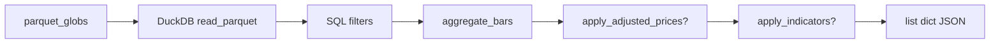

# Chapter 17 — Query Engine

| Field | Value |
|-------|-------|
| **Package** | vinu-stock-price |
| **Module** | `vinu_stock/query/engine.py` |
| **Status** | REVIEW |
| **Verified** | 2026-07-01 |
| **Prerequisites** | Chapter 09, Chapter 11 |

## Learning objectives

- Explain how DuckDB reads archive and live Parquet globs in one query.
- Apply time filters (`from`, `to`, `days`) and provider filters.
- Use optional indicators and split-adjusted prices on read.

## 1. Problem this module solves

Clients need OHLCV over arbitrary windows and intervals without copying Parquet into another database. The **query engine** opens an in-process DuckDB connection, `read_parquet` over symbol globs, filters by `bar_ts` and optional `provider`, then passes rows through aggregation, adjustment, and indicators before returning JSON.

## 2. Position in pipeline



| Step | Input | Output |
|------|-------|--------|
| Resolve globs | symbol, data_root | `archive/*.parquet`, `live/*.parquet` |
| DuckDB SELECT | from/to, provider, limit | 1m row dicts |
| Post-process | interval, adjusted, indicators | Final candle list |
| `StockService.get_candles` | days shorthand | Computes from/to epoch window |

## 3. File map

| File | Responsibility |
|------|----------------|
| `query/engine.py` | `fetch_candles` — DuckDB SQL + pipeline |
| `storage/paths.py` | `parquet_globs` |
| `query/aggregate.py` | Interval bucketing |
| `query/indicators.py` | RSI, SMA, adjusted prices |
| `service.py` | `get_candles` — days window helper |
| `server/routes_read.py` | `GET /candles/{symbol}` |

## 4. Data contracts

### Input

| Field | Type | Required | Example |
|-------|------|----------|---------|
| `data_root` | Path | yes | `./data` |
| `symbol` | string | yes | `AAPL` |
| `interval` | string | no | `1m` (default) |
| `from_ts` | int \| null | no | `1700000000` |
| `to_ts` | int \| null | no | `1700100000` |
| `provider` | string \| null | no | `polygon` |
| `limit` | int | no | `5000` (max 50000 on API) |
| `indicators` | list[str] \| null | no | `["rsi_14", "sma_20"]` |
| `adjusted` | bool | no | `false` |

### Output

| Field | Type | Example |
|-------|------|---------|
| Row dict | dict | `symbol`, `provider`, `bar_ts`, OHLCV, `adj_factor` |
| With indicators | dict | Extra keys e.g. `rsi_14`, `sma_20` |
| Empty list | [] | No globs or no matching rows |

**Note:** DuckDB query selects `symbol`, `provider`, `bar_ts`, OHLCV, `adj_factor` — not `vwap`/`trades` in API response path.

## 5. Logic (step by step)

1. **`parquet_globs(data_root, symbol)`** — if empty, return `[]`.
2. **Build SQL** with `read_parquet([patterns], union_by_name=true)`.
3. **WHERE** `symbol = ?` (uppercased), optional `bar_ts >= ?`, `bar_ts <= ?`, `provider = ?`.
4. **ORDER BY bar_ts ASC LIMIT ?`** — limit applied **before** aggregation (on 1m rows).
5. Convert DataFrame to dicts; coerce `bar_ts` to int, `adj_factor` to float.
6. **`aggregate_bars(records, interval)`** — if not `1m`, bucket OHLCV.
7. If `adjusted`: **`apply_adjusted_prices`** multiplies OHLC by `adj_factor`.
8. If `indicators`: **`apply_indicators`** adds computed columns.
9. **`StockService.get_candles`**: if `days` set and no `from_ts`, compute rolling UTC window ending at `to_ts` or now.

## 6. Configuration

| Key | YAML/env | Default | Effect |
|-----|----------|---------|--------|
| API `limit` | query param | `5000` | Max 1m rows before aggregation |
| API `days` | query param | null | Rolling window (1–3650) |
| `data_root` | settings | env | Parquet root for globs |

## 7. Worked examples

### Example A — happy path (CLI 5m candles)

```bash
vinu-stock-query candles AAPL --interval 5m --days 30 --limit 100
```

Returns JSON array; each `bar_ts` aligned to 5-minute buckets.

### Example B — edge case (epoch range + provider filter)

```bash
curl "http://127.0.0.1:8081/candles/AAPL?interval=1m&from=1700000000&to=1700100000&provider=polygon&limit=500"
```

### Example C — indicators (TASK-S01)

```bash
vinu-stock-query candles AAPL --indicators rsi_14,sma_20 --days 30 --limit 50
```

### Example D — Python direct

```python
from pathlib import Path
from vinu_stock.query.engine import fetch_candles

rows = fetch_candles(
    Path("./data"), "AAPL",
    interval="1h", days=7, limit=200, adjusted=True
)
print(len(rows), rows[-1]["close"] if rows else "empty")
```

## 8. API / CLI (if applicable)

| Method | Path / Command | Params | Response |
|--------|----------------|--------|----------|
| GET | `/candles/{symbol}` | `interval`, `from`, `to`, `days`, `provider`, `limit`, `indicators`, `adjusted` | `DataResponse` |
| — | `vinu-stock-query candles SYMBOL` | `--interval`, `--days`, `--limit`, `--indicators`, `--adjusted` | JSON stdout |

### Supported intervals

| interval | seconds |
|----------|---------|
| 1m | 60 |
| 5m | 300 |
| 15m | 900 |
| 30m | 1800 |
| 1h | 3600 |
| 4h | 14400 |
| 1d | 86400 |

## 9. SQL / queries (if applicable)

Engine SQL template (simplified):

```sql
SELECT symbol, provider, bar_ts, open, high, low, close, volume,
       COALESCE(adj_factor, 1.0) AS adj_factor
FROM read_parquet(['.../archive/*.parquet', '.../live/*.parquet'], union_by_name=true)
WHERE symbol = 'AAPL'
  AND bar_ts >= 1700000000
  AND bar_ts <= 1700100000
ORDER BY bar_ts ASC
LIMIT 5000;
```

## 10. Tests

| Test file | Asserts |
|-----------|---------|
| `tests/test_api.py` | `/candles` with temp parquet |
| `tests/test_aggregate.py` | Used by engine post-process |
| `tests/test_indicators.py` | Indicator columns on candles |

## 11. Troubleshooting

| Symptom | Likely cause | Fix |
|---------|--------------|-----|
| `count: 0` | No parquet / wrong window | Backfill; widen `days` or fix `from`/`to` |
| Sparse 1d from 1m limit | Limit applies to 1m rows pre-agg | Increase `limit` for long 1m ranges |
| Missing `vwap` in API | Not selected in engine SQL | By design in v1 query path |
| `400` on indicators | Invalid indicator name | Use `rsi_14`, `sma_20`, etc. |

## 12. Fincept / reference repo mapping

| vinu-stock-price | Reference |
|------------------|-----------|
| DuckDB on Parquet | Ad-hoc analytics without separate warehouse |
| On-read aggregation | Fincept serves multiple timeframes from ticks/bars |
| Indicators on read | Charting layer pattern (TASK-S01) |

## 13. Related chapters

- [Chapter 18 — Aggregation](ch18-aggregation.md)
- [Chapter 11 — Parquet I/O](../part-2-storage/ch11-parquet-io.md)
- [Chapter 08 — Data Layout](../part-2-storage/ch08-data-layout.md)
- [Chapter 21 — HTTP API](../part-5-operations/ch21-http-api.md)
