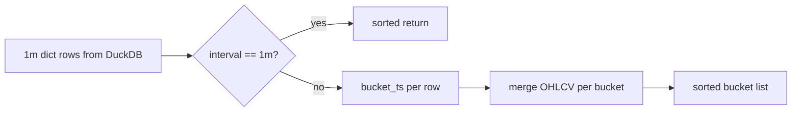

# Chapter 18 — Aggregation

| Field | Value |
|-------|-------|
| **Package** | vinu-stock-price |
| **Module** | `vinu_stock/query/aggregate.py` |
| **Status** | REVIEW |
| **Verified** | 2026-07-01 |
| **Prerequisites** | Chapter 17 |

## Learning objectives

- List supported intervals and their second bucket sizes.
- Explain OHLCV aggregation rules from 1m bars.
- Predict `bar_ts` alignment for higher timeframes.

## 1. Problem this module solves

Only **1m** bars are stored on disk. Clients routinely need 5m, 1h, or daily candles. Storing every interval would multiply storage and complicate ingest. **`aggregate_bars`** buckets 1m dicts in memory after DuckDB fetch, applying standard OHLCV roll-up rules at query time.

## 2. Position in pipeline



| Step | Input | Output |
|------|-------|--------|
| `interval_to_seconds` | `5m` | `300` |
| `bucket_ts` | bar_ts, interval_sec | Floor-aligned epoch |
| `aggregate_bars` | rows, interval | Fewer aggregated dicts |

## 3. File map

| File | Responsibility |
|------|----------------|
| `query/aggregate.py` | `INTERVAL_SECONDS`, `aggregate_bars`, `bucket_ts` |
| `query/engine.py` | Calls `aggregate_bars` after SQL |
| `server/routes_read.py` | Passes `interval` query param |
| `cli.py` | `--interval` on `candles` subcommand |

## 4. Data contracts

### Input

| Field | Type | Required | Example |
|-------|------|----------|---------|
| `rows` | list[dict] | yes | 1m rows with `bar_ts`, OHLCV |
| `interval` | string | yes | `5m`, `1h`, `1d` |

Required keys per row: `bar_ts`, `open`, `high`, `low`, `close`; optional `volume`, `symbol`, `provider`, `adj_factor`.

### Output

| Field | Type | Example |
|-------|------|---------|
| Aggregated row | dict | `bar_ts` = bucket start |
| `open` | float | First 1m open in bucket |
| `high` | float | Max of 1m highs |
| `low` | float | Min of 1m lows |
| `close` | float | Last 1m close in bucket |
| `volume` | float | Sum of 1m volumes |
| `adj_factor` | float | Last row's factor in bucket |

### Supported intervals (`INTERVAL_SECONDS`)

| Interval | Seconds |
|----------|---------|
| `1m` | 60 |
| `5m` | 300 |
| `15m` | 900 |
| `30m` | 1800 |
| `1h` | 3600 |
| `4h` | 14400 |
| `1d` | 86400 |

## 5. Logic (step by step)

1. If `interval.lower() == "1m"`, return rows sorted by `bar_ts` (no aggregation).
2. `interval_sec = interval_to_seconds(interval)` — raises `ValueError` if unsupported.
3. Sort input rows by `bar_ts`.
4. For each row, `b = bucket_ts(bar_ts, interval_sec)` where `b = (bar_ts // interval_sec) * interval_sec`.
5. **New bucket**: copy `open/high/low/close/volume/adj_factor` from first row in bucket.
6. **Existing bucket**:
   - `high = max(agg.high, row.high)`
   - `low = min(agg.low, row.low)`
   - `close = row.close` (last close wins)
   - `volume += row.volume`
   - `adj_factor = row.adj_factor` (last row wins)
7. Return buckets sorted by bucket key ascending.

**Implications:**

- Partial buckets at window edges are included (no padding).
- `1d` buckets align to UTC epoch multiples of 86400 — not exchange session boundaries.
- Aggregation runs **after** SQL `LIMIT` on 1m rows — wide windows need higher `limit`.

## 6. Configuration

| Key | YAML/env | Default | Effect |
|-----|----------|---------|--------|
| `interval` query param | HTTP/CLI | `1m` | Selects aggregation bucket |
| `INTERVAL_SECONDS` | code | fixed map | Adding intervals requires code change |

## 7. Worked examples

### Example A — happy path (5m via API)

```bash
curl "http://127.0.0.1:8081/candles/AAPL?interval=5m&days=7&limit=5000"
```

Verify bucket alignment:

```python
# bar_ts should be divisible by 300 for 5m
assert all(r["bar_ts"] % 300 == 0 for r in rows)
```

### Example B — edge case (1m passthrough)

```python
from vinu_stock.query.aggregate import aggregate_bars

rows = [{"bar_ts": 1704067200, "open": 1, "high": 2, "low": 0.5, "close": 1.5, "volume": 100, "symbol": "X"}]
out = aggregate_bars(rows, "1m")
assert out == rows  # sorted only
```

### Example C — unit-style aggregation

```python
from vinu_stock.query.aggregate import aggregate_bars, bucket_ts

# Two 1m bars in same 5m bucket
rows = [
    {"symbol": "AAPL", "provider": "p", "bar_ts": 300, "open": 10, "high": 11, "low": 9, "close": 10.5, "volume": 100, "adj_factor": 1.0},
    {"symbol": "AAPL", "provider": "p", "bar_ts": 360, "open": 10.5, "high": 12, "low": 10, "close": 11, "volume": 200, "adj_factor": 1.0},
]
agg = aggregate_bars(rows, "5m")
assert len(agg) == 1
assert agg[0]["open"] == 10
assert agg[0]["high"] == 12
assert agg[0]["low"] == 9
assert agg[0]["close"] == 11
assert agg[0]["volume"] == 300
assert bucket_ts(360, 300) == 300
```

## 8. API / CLI (if applicable)

| Method | Path / Command | Params | Response |
|--------|----------------|--------|----------|
| GET | `/candles/{symbol}` | `interval=5m` | Aggregated candles |
| — | `vinu-stock-query candles AAPL --interval 1h --days 30` | — | JSON aggregated |

## 9. SQL / queries (if applicable)

Aggregation is **not** done in SQL — DuckDB returns 1m rows; Python aggregates. For raw 1m only:

```bash
curl "http://127.0.0.1:8081/candles/AAPL?interval=1m&days=1&limit=390"
```

## 10. Tests

| Test file | Asserts |
|-----------|---------|
| `tests/test_aggregate.py` | Bucket alignment, OHLCV math, unsupported interval |

## 11. Troubleshooting

| Symptom | Likely cause | Fix |
|---------|--------------|-----|
| `Unsupported interval` | Typo e.g. `5min` | Use `5m`, `1h`, `1d` |
| Too few daily bars | Low `limit` on 1m source | Raise `limit` before aggregation |
| Daily bars not market-aligned | UTC epoch buckets | By design in v1 |

## 12. Fincept / reference repo mapping

| vinu-stock-price | Reference |
|------------------|-----------|
| On-read resample | Fincept chart timeframe switching |
| OHLCV rollup rules | Standard candle aggregation semantics |
| No multi-interval storage | Explicit v1 out-of-scope item |

## 13. Related chapters

- [Chapter 17 — Query Engine](ch17-query-engine.md)
- [Chapter 09 — BarRecord Model](../part-2-storage/ch09-bar-record-model.md)
- [Chapter 02 — Concepts and Glossary](../part-0-getting-started/ch02-concepts-glossary.md)
