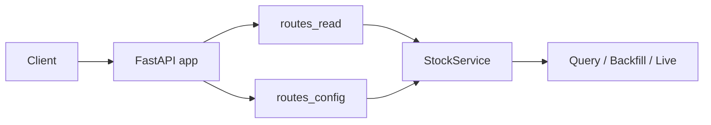

# Chapter 21 — HTTP API

| Field | Value |
|-------|-------|
| **Package** | vinu-stock-price |
| **Module** | `vinu_stock/server/` |
| **Status** | REVIEW |
| **Verified** | 2026-07-01 |
| **Prerequisites** | Chapter 17, Chapter 14 |

## Learning objectives

- List all v1 HTTP routes and their request/response shapes.
- Start the API and use OpenAPI docs and the static Web UI.
- Trigger backfill and live ingest over HTTP.

## 1. Problem this module solves

Downstream apps (charts, vinu-news joins, automation) need **HTTP access** to candles, catalog, watchlist, and settings without shelling to CLI. FastAPI exposes read routes (`routes_read.py`) and config/trigger routes (`routes_config.py`) on port **8081**, plus interactive docs and a static UI at `/ui`.

## 2. Position in pipeline



| Step | Input | Output |
|------|-------|--------|
| `create_app()` | optional `StockService` | FastAPI with routers |
| Read routes | query params | `DataResponse` JSON |
| Config routes | JSON body | Settings / watchlist / triggers |
| `/ui` | browser | Static HTML dashboard |

## 3. File map

| File | Responsibility |
|------|----------------|
| `server/app.py` | `create_app`, lifespan, router mount, `/ui` static |
| `server/routes_read.py` | `/health`, `/catalog`, `/candles` |
| `server/routes_config.py` | `/settings`, `/watchlist`, triggers |
| `server/schemas.py` | Pydantic models |
| `server/static/index.html` | Web UI (Settings, Coverage, Prices) |
| `service.py` | Business logic behind all routes |
| `cli.py` | `vinu-stock-serve` → uvicorn |

## 4. Data contracts

### Input

| Field | Type | Required | Example |
|-------|------|----------|---------|
| `symbol` | path param | yes (candles/catalog) | `AAPL` |
| `interval` | query | no | `5m` |
| `from` / `to` | query (alias) | no | UTC epoch seconds |
| `days` | query | no | `7` |
| `tickers` | JSON body | POST watchlist | `["AAPL"]` |

### Output

| Field | Type | Example |
|-------|------|---------|
| `DataResponse.count` | int | `100` |
| `DataResponse.data` | list[dict] | Candle or catalog rows |
| `SettingsResponse` | object | poll_interval, provider, data_root |
| `TriggerResponse.ok` | bool | `true` |
| `TriggerResponse.summary` | dict | Job stats |

## 5. Logic (step by step)

1. **`vinu-stock-serve`** loads config, calls `create_app()`, runs uvicorn on `VINU_STOCK_HOST`:`VINU_STOCK_PORT` (default `127.0.0.1:8081`).
2. **`create_app`** instantiates `StockService` (unless injected for tests), wires `get_service` on both route modules.
3. **Lifespan** closes owned service on shutdown.
4. **Read router** (`tags=["prices"]`):
   - `GET /health` → `service.health()` (+ provider status).
   - `GET /catalog` → all symbols.
   - `GET /catalog/{symbol}` → 404 if missing.
   - `GET /candles/{symbol}` → validates indicators, calls `get_candles`.
5. **Config router** (`tags=["config"]`):
   - `GET/PATCH /settings`.
   - `GET/POST /watchlist/tickers`, `DELETE /watchlist/tickers/{symbol}`.
   - `POST /watchlist/sync` → shared file with vinu-news.
   - `POST /backfill/trigger`, `POST /ingest/trigger`.
6. **Static UI** mounted at `/ui` when `server/static/` exists.

## 6. Configuration

| Key | YAML/env | Default | Effect |
|-----|----------|---------|--------|
| `VINU_STOCK_HOST` | env | `127.0.0.1` | Bind address |
| `VINU_STOCK_PORT` | env | `8081` | Listen port |
| `--host` / `--port` | CLI | overrides env | `vinu-stock-serve` args |

## 7. Worked examples

### Example A — happy path (health + candles)

```bash
vinu-stock-serve &
curl http://127.0.0.1:8081/health
curl "http://127.0.0.1:8081/candles/AAPL?interval=5m&days=7"
```

### Example B — edge case (404 catalog)

```bash
curl -i http://127.0.0.1:8081/catalog/NOTREAL
# HTTP/1.1 404 — Symbol not in catalog
```

### Example C — watchlist + triggers

```bash
curl -X POST http://127.0.0.1:8081/watchlist/tickers \
  -H "Content-Type: application/json" \
  -d '{"tickers":["AAPL","NVDA"]}'
curl -X POST http://127.0.0.1:8081/backfill/trigger
curl -X POST http://127.0.0.1:8081/ingest/trigger
```

### Example D — adjusted + indicators

```bash
curl "http://127.0.0.1:8081/candles/AAPL?adjusted=true&indicators=rsi_14,sma_20&days=30"
```

OpenAPI: http://127.0.0.1:8081/docs — Web UI: http://127.0.0.1:8081/ui

## 8. API / CLI (if applicable)

### Read routes (`routes_read.py`)

| Method | Path | Params | Response |
|--------|------|--------|----------|
| GET | `/health` | — | `{meta_db, data_root, symbol_count, watchlist_size, providers}` |
| GET | `/catalog` | — | `DataResponse` all symbols |
| GET | `/catalog/{symbol}` | symbol | `DataResponse` or 404 |
| GET | `/candles/{symbol}` | `interval`, `from`, `to`, `days`, `provider`, `limit`, `indicators`, `adjusted` | `DataResponse` candles |

### Config routes (`routes_config.py`)

| Method | Path | Body / Params | Response |
|--------|------|---------------|----------|
| GET | `/settings` | — | `SettingsResponse` |
| PATCH | `/settings` | `{poll_interval_sec?, default_provider?, data_root?}` | `SettingsResponse` |
| GET | `/watchlist/tickers` | — | `WatchlistResponse` |
| POST | `/watchlist/tickers` | `{tickers: [...]}` | `WatchlistResponse` |
| DELETE | `/watchlist/tickers/{symbol}` | symbol | `WatchlistResponse` |
| POST | `/watchlist/sync` | — | `{ok, added, tickers}` or 400 |
| POST | `/backfill/trigger` | — | `TriggerResponse` |
| POST | `/ingest/trigger` | — | `TriggerResponse` |

### CLI

| Command | Purpose |
|---------|---------|
| `vinu-stock-serve` | Start API |
| `vinu-stock-serve --host 0.0.0.0 --port 8081` | Docker-style bind |

## 9. SQL / queries (if applicable)

API does not expose raw SQL. Catalog data mirrors:

```sql
SELECT * FROM symbol_catalog;
```

## 10. Tests

| Test file | Asserts |
|-----------|---------|
| `tests/test_api.py` | TestClient routes, candles, triggers |
| `tests/test_watchlist_sync.py` | `POST /watchlist/sync` |

## 11. Troubleshooting

| Symptom | Likely cause | Fix |
|---------|--------------|-----|
| Connection refused | Server not running | `vinu-stock-serve` |
| Port conflict | vinu-news on 8080 | vinu-stock uses **8081** |
| `400` on sync | `VINU_SHARED_WATCHLIST_PATH` unset | Set env or skip sync |
| `400` on indicators | Unknown name | Use supported set from `indicators.py` |

## 12. Fincept / reference repo mapping

| vinu-stock-price | Reference |
|------------------|-----------|
| FastAPI factory | `vinu-news` server pattern |
| `DataResponse` | Same count+data envelope as news API |
| `/ui` static | vinu-news Web UI pattern |
| Port 8081 | Sibling service beside vinu-news 8080 |

## 13. Related chapters

- [Chapter 22 — CLI Reference](ch22-cli-reference.md)
- [Chapter 17 — Query Engine](../part-4-query/ch17-query-engine.md)
- [Chapter 23 — Docker](ch23-docker.md)
- [Chapter 26 — Config and Environment](ch26-config-env.md)
