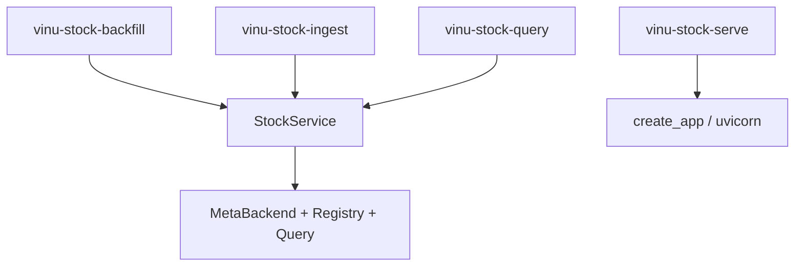

# Chapter 22 — CLI Reference

| Field | Value |
|-------|-------|
| **Package** | vinu-stock-price |
| **Module** | `vinu_stock/cli.py` |
| **Status** | REVIEW |
| **Verified** | 2026-07-01 |
| **Prerequisites** | Chapter 01, Chapter 13, Chapter 14, Chapter 17 |

## Learning objectives

- Invoke all four console scripts and their subcommands.
- Apply `--data-root` and `--meta-db` overrides consistently.
- Choose between backfill, ingest, serve, and query for daily workflows.

## 1. Problem this module solves

Operators and CI need **scriptable entry points** without running HTTP. `pyproject.toml` registers four scripts that delegate to `cli.py`: backfill history, run live ingest, serve the API, and query catalog/candles/watchlist. All heavy lifting goes through `StockService`.

## 2. Position in pipeline



| Step | Input | Output |
|------|-------|--------|
| `backfill_main` | symbols, year range | Text backfill report |
| `ingest_main` | once/continuous/interval | Text ingest report |
| `serve_main` | host, port | Running HTTP server |
| `query_main` | subcommand | JSON stdout |

## 3. File map

| File | Responsibility |
|------|----------------|
| `cli.py` | All CLI argument parsers and mains |
| `pyproject.toml` | `[project.scripts]` entry points |
| `service.py` | Shared orchestration |
| `config.py` | `load_config()` after env overrides |

## 4. Data contracts

### Input

| Field | Type | Required | Example |
|-------|------|----------|---------|
| `--data-root` | string | no | Override `VINU_STOCK_DATA_ROOT` |
| `--meta-db` | string | no | Override `VINU_STOCK_META_DB_PATH` |
| `--verbose` | flag | no | DEBUG logging (backfill/ingest) |
| symbols | positional | backfill | `AAPL NVDA` |

### Output

| Field | Type | Example |
|-------|------|---------|
| Backfill report | text | Years OK/failed, row counts |
| Ingest report | text | Bars added, symbols polled |
| Query JSON | stdout | Indented JSON |
| Serve | process | Uvicorn until SIGINT |

## 5. Logic (step by step)

**Shared helpers:**

- `_parse_data_args` adds `--data-root`, `--meta-db` to parsers.
- `_apply_env_overrides` sets `os.environ` before `StockService()` / `load_config()`.

**`vinu-stock-backfill`:**

- Symbols optional → defaults to watchlist via `service.run_backfill(None, ...)`.
- `--from-year`, `--to-year` passed through.
- Prints `result.format_report()`.

**`vinu-stock-ingest`:**

- Mutually exclusive: `--once`, `--continuous`, `--interval SECONDS`.
- `--continuous` uses `load_config().default_poll_interval_sec` for initial interval logic; sleep uses **settings DB** `poll_interval_sec` each loop.
- `--once` or no mode with no interval → single cycle.

**`vinu-stock-serve`:**

- `create_app()` + `uvicorn.run(host, port)`.

**`vinu-stock-query` subcommands:**

| Subcommand | Action |
|------------|--------|
| `candles SYMBOL` | `get_candles` → JSON |
| `catalog` | `get_catalog` → JSON |
| `watchlist TICKER...` | `add_watchlist_tickers` → JSON |

## 6. Configuration

| Key | YAML/env | Default | Effect |
|-----|----------|---------|--------|
| `--data-root` | CLI | env | Temp override for one invocation |
| `--meta-db` | CLI | env | SQLite path override |
| `--host` / `--port` | serve CLI | env | API bind |
| `--interval` | ingest CLI | — | Continuous poll seconds |
| `--days` / `--limit` | query candles | `7` / `100` | Query window |

## 7. Worked examples

### Example A — happy path (daily workflow)

```bash
vinu-stock-query watchlist AAPL NVDA
vinu-stock-backfill AAPL --from-year 2024 --to-year 2024
vinu-stock-ingest --once
vinu-stock-query candles AAPL --interval 5m --days 30 --limit 500
```

### Example B — edge case (custom data directory)

```bash
vinu-stock-backfill AAPL --from-year 2024 --to-year 2024 \
  --data-root ./mydata --meta-db ./mydata/meta.db
vinu-stock-query catalog --data-root ./mydata --meta-db ./mydata/meta.db
```

### Example C — serve in background

```bash
vinu-stock-serve --host 0.0.0.0 --port 8081
```

### Example D — indicators CLI

```bash
vinu-stock-query candles AAPL --indicators rsi_14,sma_20 --days 30 --adjusted
```

## 8. API / CLI (if applicable)

### Entry points (`pyproject.toml`)

| Command | Handler | Purpose |
|---------|---------|---------|
| `vinu-stock-backfill` | `backfill_main` | Historical archive Parquet |
| `vinu-stock-ingest` | `ingest_main` | Live append worker |
| `vinu-stock-serve` | `serve_main` | HTTP API |
| `vinu-stock-query` | `query_main` | Query subcommands |

### `vinu-stock-backfill` options

| Option | Description |
|--------|-------------|
| `SYMBOL...` | Optional; default watchlist |
| `--from-year` | Start year (auto-discover if omitted) |
| `--to-year` | End year (default: last complete year) |
| `--verbose` | DEBUG logs |
| `--data-root`, `--meta-db` | Path overrides |

### `vinu-stock-ingest` options

| Option | Description |
|--------|-------------|
| `--once` | Single cycle |
| `--continuous` | Loop with settings poll interval |
| `--interval SECONDS` | Fixed loop interval |
| `--verbose` | DEBUG logs |

### `vinu-stock-query candles` options

| Option | Default | Description |
|--------|---------|-------------|
| `--interval` | `1m` | Aggregation interval |
| `--days` | `7` | Rolling window |
| `--limit` | `100` | Max rows |
| `--indicators` | — | Comma-separated names |
| `--adjusted` | false | Split-adjusted OHLC |

## 9. SQL / queries (if applicable)

CLI does not run SQL. Use `sqlite3` on `meta.db` or `vinu-stock-query catalog` for catalog JSON.

## 10. Tests

| Test file | Asserts |
|-----------|---------|
| `tests/test_api.py` | Service layer used by CLI paths |
| Integration | Manual: run scripts in dev |

## 11. Troubleshooting

| Symptom | Likely cause | Fix |
|---------|--------------|-----|
| `command not found` | Not installed | `pip install -e ".[dev]"` |
| Backfill no symbols | Empty watchlist | `vinu-stock-query watchlist AAPL` |
| Ingest loop won't stop | `--continuous` | Ctrl+C |
| Query `[]` | Wrong `--data-root` | Match backfill data path |

## 12. Fincept / reference repo mapping

| vinu-stock-price | Reference |
|------------------|-----------|
| Four scripts | `vinu-news` CLI pattern |
| `StockService` context manager | Same lifecycle as news service |
| `--data-root` override | Test/CI temp dir pattern |

## 13. Related chapters

- [Chapter 01 — Install and First Run](../part-0-getting-started/ch01-install-first-run.md)
- [Chapter 21 — HTTP API](ch21-http-api.md)
- [Chapter 13 — Backfill Flow](../part-3-ingest/ch13-backfill-flow.md)
- [Chapter 14 — Live Ingest](../part-3-ingest/ch14-live-ingest.md)
- [Chapter 26 — Config and Environment](ch26-config-env.md)
