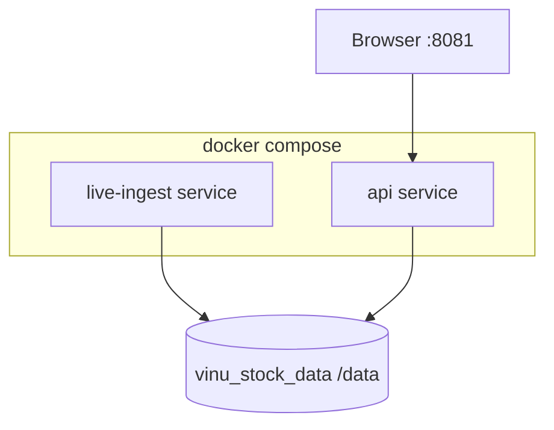

# Chapter 23 — Docker

| Field | Value |
|-------|-------|
| **Package** | vinu-stock-price |
| **Module** | `Dockerfile`, `docker-compose.yml` |
| **Status** | REVIEW |
| **Verified** | 2026-07-01 |
| **Prerequisites** | Chapter 01, Chapter 21 |

## Learning objectives

- Run the API and live-ingest services with Docker Compose.
- Persist data in the `vinu_stock_data` volume at `/data`.
- Run manual backfill inside the `api` container.

## 1. Problem this module solves

Production-like deployments need **isolated processes** for the HTTP API and continuous ingest, with a **shared data volume** for `meta.db` and Parquet. Docker packages Python 3.12, installs the editable package, and runs `vinu-stock-ingest` and `vinu-stock-serve` against `/data` without binding host paths.

## 2. Position in pipeline



| Step | Input | Output |
|------|-------|--------|
| `docker compose up` | `.env`, Dockerfile | Two running containers |
| `live-ingest` | watchlist in meta.db | Appends live Parquet |
| `api` | shared volume | Serves HTTP on 8081 |
| Manual backfill | `docker compose run` | Archive Parquet on volume |

## 3. File map

| File | Responsibility |
|------|----------------|
| `Dockerfile` | Python 3.12-slim, `pip install -e ".[dev]"` |
| `docker-compose.yml` | `live-ingest` + `api` services, volume |
| `.env.example` | API keys and env template |
| `cli.py` | Commands invoked in containers |

## 4. Data contracts

### Input

| Field | Type | Required | Example |
|-------|------|----------|---------|
| `.env` | file | recommended | API keys |
| `vinu_stock_data` volume | Docker volume | auto-created | Persists `/data` |
| Host port | mapping | — | `8081:8081` |

### Output

| Field | Type | Example |
|-------|------|---------|
| Container `/data/meta.db` | SQLite | Catalog + watchlist |
| Container `/data/prices/` | Parquet tree | Same layout as local |
| API URL | HTTP | http://localhost:8081 |

## 5. Logic (step by step)

**Dockerfile:**

1. Base `python:3.12-slim`, `WORKDIR /app/vinu-stock-price`.
2. `COPY` project, `pip install -e ".[dev]"`.
3. Default env: `VINU_STOCK_DATA_ROOT=/data`, `VINU_STOCK_META_DB_PATH=/data/meta.db`.
4. `VOLUME ["/data"]`, `EXPOSE 8081`.

**docker-compose.yml services:**

| Service | Command | Ports | Volume |
|---------|---------|-------|--------|
| `live-ingest` | `vinu-stock-ingest --interval 60` | — | `vinu_stock_data:/data` |
| `api` | `vinu-stock-serve --host 0.0.0.0 --port 8081` | `8081:8081` | same volume |

Both load `env_file: .env` and override data paths to `/data`. `api` `depends_on: live-ingest`. **Backfill is not auto-started** — run manually (heavy).

**Optional:** `VINU_SHARED_WATCHLIST_PATH` commented for vinu-news watchlist sync (mount shared file).

## 6. Configuration

| Key | YAML/env | Default | Effect |
|-----|----------|---------|--------|
| `VINU_STOCK_DATA_ROOT` | compose env | `/data` | In-container data root |
| `VINU_STOCK_META_DB_PATH` | compose env | `/data/meta.db` | Catalog path |
| `env_file: .env` | compose | — | Provider API keys |
| `restart` | compose | `unless-stopped` | Auto-restart containers |
| `vinu_stock_data` | named volume | Docker-managed | Persistence |

## 7. Worked examples

### Example A — happy path (start stack)

```bash
cd vinu-stock-price
cp .env.example .env
# Edit .env with API keys
docker compose up --build
```

- API: http://localhost:8081
- Docs: http://localhost:8081/docs
- UI: http://localhost:8081/ui
- Live ingest runs in `live-ingest` container every 60s

### Example B — edge case (manual backfill in container)

```bash
docker compose run --rm api vinu-stock-backfill AAPL --from-year 2023 --to-year 2024
```

Uses same `/data` volume as running services. Not auto-run on boot by design.

### Example C — add watchlist then trigger via API

```bash
docker compose up -d
curl -X POST http://localhost:8081/watchlist/tickers \
  -H "Content-Type: application/json" \
  -d '{"tickers":["AAPL"]}'
curl -X POST http://localhost:8081/backfill/trigger
```

### Example D — inspect volume data (host)

```bash
docker compose exec api ls -la /data/prices/1m/AAPL/archive/
```

## 8. API / CLI (if applicable)

| Method | Path / Command | Params | Response |
|--------|----------------|--------|----------|
| — | `docker compose up --build` | — | Starts services |
| — | `docker compose run --rm api vinu-stock-backfill ...` | CLI args | Backfill report |
| — | `docker compose logs live-ingest` | — | Ingest stdout |
| GET | `http://localhost:8081/health` | — | Confirms API + paths |

## 9. SQL / queries (if applicable)

Exec into container:

```bash
docker compose exec api sh -c "apt-get update && apt-get install -y sqlite3 && sqlite3 /data/meta.db 'SELECT symbol, backfill_status FROM symbol_catalog'"
```

Or copy `meta.db` locally for inspection.

## 10. Tests

| Test file | Asserts |
|-----------|---------|
| `tests/test_api.py` | API logic (not Docker-specific) |
| Manual | `docker compose up` smoke test |

## 11. Troubleshooting

| Symptom | Likely cause | Fix |
|---------|--------------|-----|
| Empty candles | No backfill in Docker | `docker compose run --rm api vinu-stock-backfill ...` |
| API keys ignored | Missing `.env` | `cp .env.example .env`, rebuild |
| Data lost on `down` | Anonymous volume removed | Use named `vinu_stock_data` (default) |
| Port 8081 in use | Host conflict | Change compose ports mapping |

## 12. Fincept / reference repo mapping

| vinu-stock-price | Reference |
|------------------|-----------|
| Dual-service compose | API + worker split common in microservices |
| Shared volume | Single source of truth for bars |
| vinu-news | Sibling package; can share watchlist via `VINU_SHARED_WATCHLIST_PATH` |

## 13. Related chapters

- [Chapter 01 — Install and First Run](../part-0-getting-started/ch01-install-first-run.md)
- [Chapter 21 — HTTP API](ch21-http-api.md)
- [Chapter 14 — Live Ingest](../part-3-ingest/ch14-live-ingest.md)
- [Chapter 26 — Config and Environment](ch26-config-env.md)
