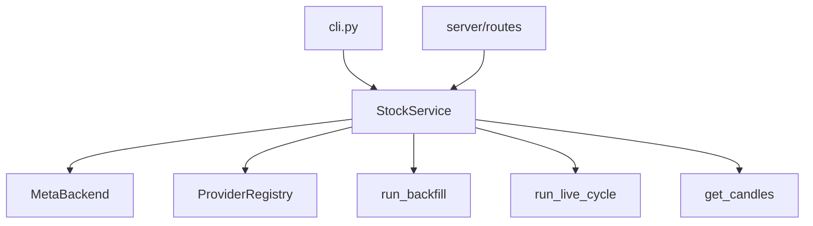

# Chapter 24 — StockService Facade

| Field | Value |
|-------|-------|
| **Package** | vinu-stock-price |
| **Module** | `vinu_stock/service.py` |
| **Status** | REVIEW |
| **Verified** | 2026-07-01 |
| **Prerequisites** | Chapter 13, Chapter 14, Chapter 17, Chapter 21 |

## Learning objectives

- Map `StockService` methods to backfill, live, query, catalog, and settings subsystems.
- Use context manager lifecycle for tests and scripts.
- Compare `StockService` to vinu-news `NewsService` facade pattern.

## 1. Problem this module solves

CLI entry points and FastAPI routes should not duplicate wiring for `MetaBackend`, `ProviderRegistry`, and path resolution. **`StockService`** is the single orchestrator: construct once, call high-level methods, share one catalog connection. It mirrors [`vinu-news/vinu_news/service.py`](../../../../vinu-news/vinu_news/service.py) with stock-specific additions (`run_backfill`, `get_candles`, `get_catalog`).

## 2. Position in pipeline



| Step | Input | Output |
|------|-------|--------|
| `__init__` | optional backend, config | Registry + catalog ready |
| `run_backfill` | symbols, years | `BackfillCycleResult` |
| `run_live_cycle` | symbols | `LiveCycleResult` |
| `get_candles` | symbol, window | list[dict] via DuckDB |
| `health` | — | settings + provider status |

## 3. File map

| File | Responsibility |
|------|----------------|
| `service.py` | `StockService`, `BackfillCycleResult`, `LiveCycleResult` |
| `storage/backend.py` | `MetaBackend` — catalog, watchlist, settings |
| `backfill/orchestrator.py` | Called by `run_backfill` |
| `live/ingest_cycle.py` | Called by `run_live_cycle` |
| `query/engine.py` | Called by `get_candles` |
| `server/app.py` | `get_service()` singleton pattern |

## 4. Data contracts

### Input

| Field | Type | Required | Example |
|-------|------|----------|---------|
| `backend` | MetaBackend \| None | no | Inject for tests |
| `config` | VinuStockConfig \| None | no | Defaults via `load_config()` |
| `symbols` | list[str] \| None | no | Defaults to watchlist |
| `from_year` / `to_year` | int \| None | no | Backfill bounds |
| `days` | int \| None | no | Shorthand for candle window |

### Output

| Field | Type | Example |
|-------|------|---------|
| `BackfillCycleResult.summary` | BackfillSummary | Jobs run, rows written |
| `LiveCycleResult.summary` | LiveIngestSummary | bars_added, failures |
| `get_catalog()` | list[dict] | Symbol metadata |
| `health()` | dict | data_root, providers, counts |

## 5. Logic (step by step)

1. **`StockService.__init__`** — load config; create or accept `MetaBackend`; set `_owns_backend`; build `ProviderRegistry`.
2. **`data_root` property** — reads from settings DB (`get_settings().data_root`), not only env default.
3. **`close()` / context manager** — closes backend if owned.
4. **Watchlist** — delegates to `MetaBackend` (`get_watchlist`, `add_watchlist_tickers`, `remove_watchlist_ticker`).
5. **`sync_watchlist_from_shared`** — requires `VINU_SHARED_WATCHLIST_PATH`; calls `watchlist.shared.sync_from_shared`.
6. **`run_backfill`** — resolves symbols; calls `run_backfill(..., data_root, catalog, registry)`.
7. **`run_live_cycle`** — same symbol resolution; wraps `LiveIngestSummary` with `watchlist_size`.
8. **`get_candles`** — if `days` set without `from_ts`, computes UTC window; calls `fetch_candles`.
9. **`health`** — `backend.health_info(data_root)` + `registry.provider_status()`.

## 6. Configuration

| Key | YAML/env | Default | Effect |
|-----|----------|---------|--------|
| `VINU_STOCK_META_DB_PATH` | env | `{data_root}/meta.db` | Backend SQLite path |
| `VINU_STOCK_DATA_ROOT` | env | `./data` | Default before settings patch |
| `VINU_SHARED_WATCHLIST_PATH` | env | unset | `sync_watchlist_from_shared` |

## 7. Worked examples

### Example A — happy path (script with context manager)

```python
from vinu_stock.service import StockService

with StockService() as svc:
    svc.add_watchlist_tickers(["AAPL"])
    result = svc.run_backfill(from_year=2024, to_year=2024)
    print(result.format_report())
    candles = svc.get_candles("AAPL", days=7, interval="5m")
    print(len(candles), candles[-1]["close"])
```

### Example B — edge case (shared watchlist not configured)

```python
from vinu_stock.service import StockService

svc = StockService()
out = svc.sync_watchlist_from_shared()
assert out["ok"] is False
assert "VINU_SHARED_WATCHLIST_PATH" in out["message"]
svc.close()
```

### Example C — health check

```python
from vinu_stock.service import StockService

svc = StockService()
h = svc.health()
print(h["providers"])  # list of {id, enabled, configured, ...}
```

## 8. API / CLI (if applicable)

| Method | Path / Command | Params | Response |
|--------|----------------|--------|----------|
| All routes | via `get_service()` | — | Delegates to StockService |
| — | `vinu-stock-backfill` | — | `run_backfill` |
| — | `vinu-stock-ingest` | — | `run_live_cycle` |
| — | `vinu-stock-query` | — | catalog, candles, watchlist |
| POST | `/watchlist/sync` | — | `sync_watchlist_from_shared` |

### NewsService vs StockService

| NewsService (vinu-news) | StockService |
|-------------------------|--------------|
| `run_ingestion_cycle()` | `run_live_cycle()` |
| `get_ticker_news()` | `get_candles()` |
| watchlist CRUD | same |
| — | `run_backfill()` |
| — | `get_catalog()` |
| — | `sync_watchlist_from_shared()` |

## 9. SQL / queries (if applicable)

StockService does not execute SQL directly; catalog queries go through `MetaBackend.catalog` (SQLite). Example via service output:

```python
svc.get_catalog("AAPL")[0]["gap_count"]
```

## 10. Tests

| Test file | Asserts |
|-----------|---------|
| `tests/test_api.py` | Service wired in FastAPI TestClient |
| `tests/test_catalog.py` | Backend used by service layer |
| `tests/test_watchlist_sync.py` | Shared sync path |

## 11. Troubleshooting

| Symptom | Likely cause | Fix |
|---------|--------------|-----|
| Wrong data directory | Settings DB overrides env | `PATCH /settings` or check `get_settings()` |
| `database is locked` | Multiple processes on meta.db | One writer for ingest; API read-mostly |
| Empty backfill symbols | Empty watchlist | Add tickers first |
| Service stale providers | Registry at init | Restart process after yaml/env change |

## 12. Fincept / reference repo mapping

| vinu-stock-price | Reference |
|------------------|-----------|
| `service.py` facade | vinu-news `NewsService` |
| Context manager | Clean shutdown in scripts/tests |
| Fincept terminal | Single service object for UI backend |

## 13. Related chapters

- [Chapter 21 — HTTP API](../part-5-operations/ch21-http-api.md)
- [Chapter 22 — CLI Reference](../part-5-operations/ch22-cli-reference.md)
- [Chapter 25 — Shared Watchlist](ch25-watchlist-shared.md)
- [Chapter 13 — Backfill Flow](../part-3-ingest/ch13-backfill-flow.md)
- [Chapter 14 — Live Ingest](../part-3-ingest/ch14-live-ingest.md)
