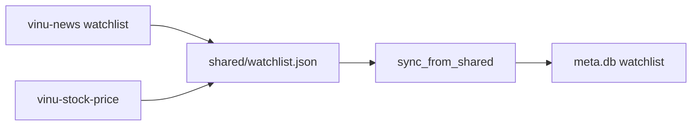

# Chapter 25 — Shared Watchlist with vinu-news

| Field | Value |
|-------|-------|
| **Package** | vinu-stock-price |
| **Module** | `vinu_stock/watchlist/shared.py` |
| **Status** | REVIEW |
| **Verified** | 2026-07-01 |
| **Prerequisites** | Chapter 01, Chapter 24 |

## Learning objectives

- Read and write the shared JSON watchlist format (TASK-X01).
- Merge shared tickers into local SQLite via `sync_from_shared`.
- Configure `VINU_SHARED_WATCHLIST_PATH` for both sibling packages.

## 1. Problem this module solves

News and price pipelines should track the **same tickers** without manual duplicate entry. TASK-X01 defines a small JSON file (`tickers` array + `updated_at`) that both vinu-news and vinu-stock-price can read. Local watchlists remain authoritative in each package's `meta.db`; **sync** performs a **union merge** (add missing tickers, never delete via sync).

## 2. Position in pipeline



| Step | Input | Output |
|------|-------|--------|
| `read_shared` | JSON path | `list[str]` uppercase tickers |
| `write_shared` | tickers | JSON file with sorted unique tickers |
| `sync_from_shared` | WatchlistStore + path | List of newly added tickers |
| `export_to_shared` | store → path | Push local list to JSON |

## 3. File map

| File | Responsibility |
|------|----------------|
| `watchlist/shared.py` | `read_shared`, `write_shared`, `sync_from_shared`, `export_to_shared` |
| `watchlist/store.py` | SQLite watchlist CRUD |
| `service.py` | `sync_watchlist_from_shared()` wrapper |
| `server/routes_config.py` | `POST /watchlist/sync` |
| `config.py` | `shared_watchlist_path` from env |

## 4. Data contracts

### Shared JSON file

| Field | Type | Required | Example |
|-------|------|----------|---------|
| `tickers` | string[] | yes | `["AAPL", "MSFT", "NVDA"]` |
| `updated_at` | int | yes | UTC epoch seconds |

### Input

| Field | Type | Required | Example |
|-------|------|----------|---------|
| `VINU_SHARED_WATCHLIST_PATH` | path | for sync API | `/data/shared/watchlist.json` |
| `tickers` (write) | list[str] | yes | Mixed case OK — normalized |

### Output

| Field | Type | Example |
|-------|------|---------|
| `sync` API `added` | list[str] | `["TSLA"]` newly merged |
| `sync` API `tickers` | list[str] | Full local watchlist after sync |
| `ok: false` | dict | Path env not set |

## 5. Logic (step by step)

1. **`read_shared(path)`** — if file missing, return `[]`; parse JSON; uppercase strip each ticker.
2. **`write_shared(path)`** — mkdir parents; sort unique uppercase tickers; write `updated_at=now`.
3. **`sync_from_shared(store, path)`** — `shared = read_shared(path)`; if empty return `[]`; else `store.add_tickers(shared)` (union).
4. **`export_to_shared(store, path)`** — `write_shared(path, store.list_tickers())`.
5. **`StockService.sync_watchlist_from_shared`** — if `config.shared_watchlist_path is None`, return error dict; else call sync and include full ticker list.
6. **HTTP** — `POST /watchlist/sync` returns JSON from service method.

## 6. Configuration

| Key | YAML/env | Default | Effect |
|-----|----------|---------|--------|
| `VINU_SHARED_WATCHLIST_PATH` | env | unset | Enables shared file sync |
| vinu-news equivalent | env | sibling doc | Same path in both `.env` files |

## 7. Worked examples

### Example A — happy path (create shared file and sync)

```bash
mkdir -p /tmp/shared
cat > /tmp/shared/watchlist.json <<'EOF'
{"tickers": ["AAPL", "NVDA"], "updated_at": 0}
EOF
export VINU_SHARED_WATCHLIST_PATH=/tmp/shared/watchlist.json

vinu-stock-serve &
curl -X POST http://127.0.0.1:8081/watchlist/sync
curl http://127.0.0.1:8081/watchlist/tickers
```

Response includes `added` tickers not previously local.

### Example B — edge case (empty shared file)

```python
from pathlib import Path
from vinu_stock.watchlist.shared import read_shared, sync_from_shared
from vinu_stock.watchlist.store import WatchlistStore

path = Path("/tmp/empty.json")
path.write_text('{"tickers": [], "updated_at": 0}')
store = WatchlistStore(...)  # see tests
assert sync_from_shared(store, path) == []
```

### Example C — export local to shared

```python
from vinu_stock.watchlist.shared import export_to_shared

export_to_shared(store, Path("/tmp/shared/watchlist.json"))
```

## 8. API / CLI (if applicable)

| Method | Path / Command | Params | Response |
|--------|----------------|--------|----------|
| POST | `/watchlist/sync` | — | `{ok, added, tickers}` or error |
| GET | `/watchlist/tickers` | — | Local list after sync |
| POST | `/watchlist/tickers` | body tickers | Add without shared file |

No dedicated CLI for sync in v1; use curl or Python `StockService`.

## 9. SQL / queries (if applicable)

```sql
-- Local watchlist table (schema in settings)
SELECT ticker FROM watchlist ORDER BY ticker;
```

Compare to shared file on disk outside SQLite.

## 10. Tests

| Test file | Asserts |
|-----------|---------|
| `tests/test_watchlist_sync.py` | `test_write_and_read_shared`, `test_sync_from_shared_merges` |

## 11. Troubleshooting

| Symptom | Likely cause | Fix |
|---------|--------------|-----|
| `VINU_SHARED_WATCHLIST_PATH not set` | Env missing | Set path; restart server |
| Sync adds nothing | Tickers already local | Expected union behavior |
| News and stock lists diverge | Only one side exports | Call `export_to_shared` or maintain JSON manually |
| Invalid JSON | Hand-edited file | Validate with `python -m json.tool` |

## 12. Fincept / reference repo mapping

| vinu-stock-price | Reference |
|------------------|-----------|
| TASK-X01 | enhancement-doc1 cross-package watchlist |
| JSON sidecar | Lightweight vs shared Redis/DB |
| vinu-news watchlist | Volume 1 sibling — same path convention |

## 13. Related chapters

- [Chapter 24 — StockService Facade](ch24-service-facade.md)
- [Chapter 21 — HTTP API](ch21-http-api.md)
- [Chapter 00 — Preface](../part-0-getting-started/ch00-preface.md)
- [vinu-news watchlist docs](../../../../vinu-news/docs/book/part-5-operations/ch23-watchlist.md) (if present)
