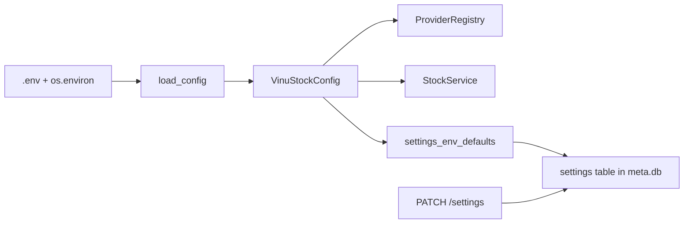

# Chapter 26 — Config and Environment

| Field | Value |
|-------|-------|
| **Package** | vinu-stock-price |
| **Module** | `vinu_stock/config.py` |
| **Status** | REVIEW |
| **Verified** | 2026-07-01 |
| **Prerequisites** | Chapter 01, Chapter 04 |

## Learning objectives

- List every environment variable and its default from `load_config()`.
- Distinguish env defaults from persisted settings in `meta.db`.
- Override paths at runtime via CLI, API, or Docker.

## 1. Problem this module solves

The same codebase runs locally, in CI, and in Docker with different data roots, ports, and API keys. **`config.py`** centralizes environment loading (via `python-dotenv`), exposes a frozen **`VinuStockConfig`** dataclass, and seeds **settings store** defaults. Provider secrets stay in env; provider **order** stays in YAML.

## 2. Position in pipeline



| Step | Input | Output |
|------|-------|--------|
| `_ensure_dotenv_loaded` | package `.env`, cwd `.env` | Populated `os.environ` |
| `load_config()` | env vars | `VinuStockConfig` |
| `settings_env_defaults()` | config | Dict for settings schema seed |
| CLI `_apply_env_overrides` | `--data-root` | Temporary env mutation |

## 3. File map

| File | Responsibility |
|------|----------------|
| `config.py` | `VinuStockConfig`, `load_config`, defaults |
| `.env.example` | Documented template |
| `settings/store.py` | Persisted settings (poll, provider, data_root) |
| `settings/schema.sql` | Settings table DDL |
| `providers/config/providers.yaml` | Non-secret provider config |
| `cli.py` | `--data-root`, `--meta-db` overrides |
| `server/routes_config.py` | `PATCH /settings` |

## 4. Data contracts

### Input

| Field | Type | Required | Example |
|-------|------|----------|---------|
| `VINU_STOCK_DATA_ROOT` | path string | no | `./data` |
| `VINU_STOCK_META_DB_PATH` | path string | no | `./data/meta.db` |
| `POLYGON_API_KEY` | string | no | Polygon key |
| `VINU_SHARED_WATCHLIST_PATH` | path | no | Shared JSON with vinu-news |

### Output

| Field | Type | Example |
|-------|------|---------|
| `VinuStockConfig.data_root` | Path | `PosixPath('data')` |
| `VinuStockConfig.port` | int | `8081` |
| Settings DB | persisted | May override `data_root` at runtime |

### `VinuStockConfig` fields (from `load_config()`)

| Attribute | Env var | Default |
|-----------|---------|---------|
| `data_root` | `VINU_STOCK_DATA_ROOT` | `{cwd}/data` |
| `meta_db_path` | `VINU_STOCK_META_DB_PATH` | `{data_root}/meta.db` |
| `default_poll_interval_sec` | `VINU_STOCK_POLL_INTERVAL_SEC` | `60` |
| `host` | `VINU_STOCK_HOST` | `127.0.0.1` |
| `port` | `VINU_STOCK_PORT` | `8081` |
| `default_provider` | `VINU_STOCK_DEFAULT_PROVIDER` | `polygon` |
| `polygon_api_key` | `POLYGON_API_KEY` | `""` |
| `alpaca_api_key` | `ALPACA_API_KEY` | `""` |
| `alpaca_api_secret` | `ALPACA_API_SECRET` | `""` |
| `alpaca_data_base_url` | `ALPACA_DATA_BASE_URL` | `https://data.alpaca.markets` |
| `shared_watchlist_path` | `VINU_SHARED_WATCHLIST_PATH` | `None` |

## 5. Logic (step by step)

1. **First `load_config()` call** loads dotenv from `vinu-stock-price/.env` then cwd `.env` (once, guarded by `_ENV_LOADED`).
2. **`data_root`**: empty env → `Path.cwd() / "data"`.
3. **`meta_db_path`**: empty env → `data_root / "meta.db"`.
4. **`shared_watchlist_path`**: empty → `None`; else `Path(...)`.
5. **Numeric fields** parsed with `int()`; strings passed through.
6. **`MetaBackend`** on init seeds settings from `settings_env_defaults()` if DB empty.
7. **`StockService.data_root`** reads **persisted** `settings.data_root`, not raw env — PATCH can redirect without restart.
8. **`ProviderRegistry`** receives `VinuStockConfig` for Polygon/Alpaca credentials.
9. **CLI overrides** set env vars before `load_config()` in that process only.

**Precedence for data paths:**

| Context | Wins |
|---------|------|
| Query/backfill in running `StockService` | Settings DB `data_root` |
| Fresh CLI with `--data-root` | CLI env override |
| Docker compose | `environment:` block → `/data` |

## 6. Configuration

| Key | YAML/env | Default | Effect |
|-----|----------|---------|--------|
| All vars above | `.env` | see table | Startup configuration |
| `providers.yaml` | YAML | shipped defaults | Provider order (not env) |
| `PATCH /settings` | HTTP | — | `poll_interval_sec` ≥ 10, `data_root`, `default_provider` |

### Provider credentials (env only)

| Provider | Variables |
|----------|-----------|
| polygon | `POLYGON_API_KEY` |
| alpaca | `ALPACA_API_KEY`, `ALPACA_API_SECRET`, `ALPACA_DATA_BASE_URL` |
| yahoo | none |

## 7. Worked examples

### Example A — happy path (.env setup)

```bash
cp .env.example .env
```

Edit `.env`:

```
VINU_STOCK_DATA_ROOT=./data
POLYGON_API_KEY=your_key_here
VINU_STOCK_POLL_INTERVAL_SEC=60
```

```python
from vinu_stock.config import load_config
cfg = load_config()
print(cfg.data_root, cfg.port, bool(cfg.polygon_api_key))
```

### Example B — edge case (runtime settings PATCH)

```bash
vinu-stock-serve &
curl http://127.0.0.1:8081/settings
curl -X PATCH http://127.0.0.1:8081/settings \
  -H "Content-Type: application/json" \
  -d '{"poll_interval_sec": 120, "default_provider": "alpaca"}'
```

Persisted in `meta.db`; ingest `--continuous` sleeps per patched `poll_interval_sec`.

### Example C — shared watchlist with vinu-news (TASK-X01)

```bash
# In .env for both packages:
VINU_SHARED_WATCHLIST_PATH=/path/to/shared/watchlist.json

curl -X POST http://127.0.0.1:8081/watchlist/sync
```

Returns `400` if env not set.

### Example D — inspect effective config in health

```bash
curl http://127.0.0.1:8081/health | python -m json.tool
```

Shows `data_root`, `meta_db`, and per-provider `configured` flags.

## 8. API / CLI (if applicable)

| Method | Path / Command | Params | Response |
|--------|----------------|--------|----------|
| GET | `/settings` | — | `poll_interval_sec`, `default_provider`, `data_root` |
| PATCH | `/settings` | partial body | Updated settings |
| — | `vinu-stock-* --data-root PATH` | all CLIs | Env override |
| — | `vinu-stock-* --meta-db PATH` | backfill/ingest/query | DB override |

## 9. SQL / queries (if applicable)

```sql
-- Persisted settings (table from settings/schema.sql)
SELECT * FROM settings;
```

Env vars seed initial values; PATCH updates rows.

## 10. Tests

| Test file | Asserts |
|-----------|---------|
| `tests/test_api.py` | Settings GET/PATCH |
| `tests/test_watchlist_sync.py` | `VINU_SHARED_WATCHLIST_PATH` behavior |

## 11. Troubleshooting

| Symptom | Likely cause | Fix |
|---------|--------------|-----|
| `POLYGON_API_KEY not set` | Empty env | Add to `.env`, restart process |
| Wrong data directory | Settings DB override | `GET /settings`, PATCH or align CLI |
| Dotenv not loaded | Cwd not package root | Place `.env` in `vinu-stock-price/` |
| Sync watchlist 400 | `VINU_SHARED_WATCHLIST_PATH` unset | Set path in `.env` |
| Provider yaml change ignored | Registry cached at init | Restart serve/ingest |

## 12. Fincept / reference repo mapping

| vinu-stock-price | Reference |
|------------------|-----------|
| `config.py` + dotenv | `vinu-news/vinu_news/config.py` |
| Env secrets / YAML feeds | Same split as news RSS config |
| `settings_env_defaults` | News settings seed pattern |

## 13. Related chapters

- [Chapter 01 — Install and First Run](../part-0-getting-started/ch01-install-first-run.md)
- [Chapter 04 — providers.yaml](../part-1-providers/ch04-providers-yaml.md)
- [Chapter 21 — HTTP API](ch21-http-api.md)
- [Chapter 23 — Docker](ch23-docker.md)
- [Chapter 03 — Provider Architecture](../part-1-providers/ch03-provider-architecture.md)
