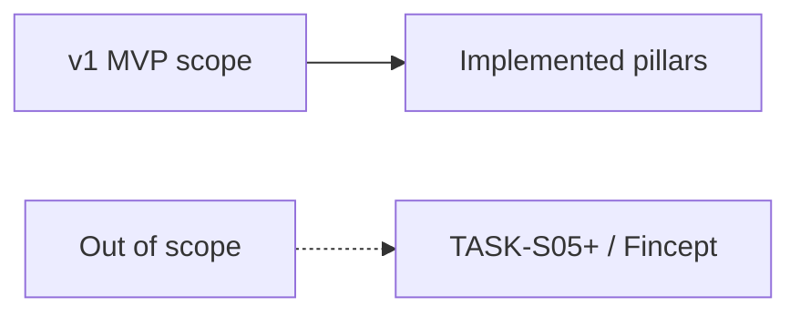

# Appendix A — Out of Scope for v1

| Field | Value |
|-------|-------|
| **Package** | vinu-stock-price |
| **Module** | — |
| **Status** | REVIEW |
| **Verified** | 2026-07-01 |
| **Prerequisites** | Chapter 00 |

## Learning objectives

- List features explicitly excluded from v1 MVP.
- Avoid planning work that belongs in enhancement TASKs or Fincept-scale scope.
- Point stakeholders to roadmap appendix for planned follow-ups.

## 1. Problem this module solves

Without a clear **out-of-scope** boundary, contributors re-propose Postgres backends, multi-interval Parquet, or 22-broker Fincept unions. This appendix records what **vinu-stock-price v1 deliberately does not do**, sourced from [`complete_guide_stock_price.md`](../../complete_guide_stock_price.md) and enhancement docs.

## 2. Position in pipeline

| Step | Input | Output |
|------|-------|--------|
| Read this appendix | feature request | In-scope vs defer decision |
| Check apx-d | TASK id | Target chapter if planned |

## 3. File map

| File | Responsibility |
|------|----------------|
| `docs/complete_guide_stock_price.md` | Legacy § Out of scope |
| `vinu-news-stock-price-enhancement/enhancement-doc1.md` | TASK-S05+ definitions |
| `docs/book/part-6-appendices/apx-d-roadmap.md` | Planned work map |

## 4. Data contracts

### In scope (v1 summary)

| Capability | Module |
|------------|--------|
| 1m Parquet storage | `storage/parquet.py` |
| 3 providers (Polygon, Alpaca, Yahoo) | `providers/` |
| DuckDB query + aggregate | `query/` |
| Backfill + live ingest | `backfill/`, `live/` |
| FastAPI + CLI | `server/`, `cli.py` |

### Out of scope (explicit)

| Item | Notes | Future task |
|------|-------|-------------|
| Fincept 22 brokers / WebSocket union / DataHub | Reference architecture only | — |
| Multiple intervals on disk | Query-time aggregate only | — |
| SQLite table per symbol | Parquet per symbol tree | — |
| Postgres backend | SQLite catalog + Parquet | — |
| Year-end archive rollover job | Documented fast-follow | TASK-S09 |
| FMP provider | Not in `vinu_stock` | TASK-S06 |
| Fundamentals sidecar | EPS, ratios | TASK-S07 |
| WebSocket sub-minute live | 1m poll only | TASK-S08 |
| Full qlib / FinRL port | Research reference | — |
| News + candles unified API | Cross-package | TASK-X02 |
| `pandas_market_calendars` live skip | Partial gap logic only | TASK-S04 (partial) |

## 5. Logic (step by step)

1. If the feature requires **new on-disk interval directories** → out of scope; use `query/aggregate.py`.
2. If it requires **a new SQL server** → out of scope; use DuckDB + Parquet.
3. If it is **another broker** → check TASK-S06 (FMP); else providers.yaml extension post-v1.
4. If it is **real-time sub-minute** → TASK-S08.
5. If it merges news + prices in one HTTP resource → TASK-X02 in enhancement doc, not v1.

## 6. Configuration

| Key | YAML/env | Default | Effect |
|-----|----------|---------|--------|
| — | — | — | No config for out-of-scope features |

## 7. Worked examples

### Example A — happy path (in-scope request)

"We need 5m candles for backtest" → use `GET /candles/AAPL?interval=5m` ([ch18](../part-4-query/ch18-aggregation.md)). **In scope.**

### Example B — edge case (out-of-scope request)

"Store 5m Parquet natively for speed" → **out of scope**; aggregate at query or precompute in your notebook.

### Example C — borderline (partial)

"Skip live ingest when NYSE closed" → TASK-S04 **partial**; gap logic exists for backfill only ([ch15](../part-3-ingest/ch15-market-calendar.md)).

## 8. API / CLI (if applicable)

| Method | Path / Command | Params | Response |
|--------|----------------|--------|----------|
| — | — | — | No API for out-of-scope features |

## 9. SQL / queries (if applicable)

No SQL. For cross-package news SQL, see vinu-news textbook.

## 10. Tests

| Test file | Asserts |
|-----------|---------|
| — | Out-of-scope features have no tests by design |

## 11. Troubleshooting

| Symptom | Likely cause | Fix |
|---------|--------------|-----|
| "Why no FMP?" | TASK-S06 not implemented | Use Yahoo fallback or Polygon |
| "Why poll not WS?" | v1 scope | TASK-S08 |
| Duplicate Fincept broker code | Scope creep | Extend `providers.yaml` minimally |

## 12. Fincept / reference repo mapping

| vinu-stock-price v1 | Fincept / FinRL full stack |
|---------------------|----------------------------|
| 3 providers | 22+ brokers |
| 1m Parquet | Multi-interval DB |
| HTTP poll ingest | WebSocket union |
| Local DuckDB | DataHub cluster |

## 13. Related chapters

- [Appendix D — Roadmap](apx-d-roadmap.md)
- [Chapter 00 — Preface](../part-0-getting-started/ch00-preface.md)
- [Chapter 03 — Provider Architecture](../part-1-providers/ch03-provider-architecture.md)
- [complete_guide_stock_price.md](../../complete_guide_stock_price.md)
