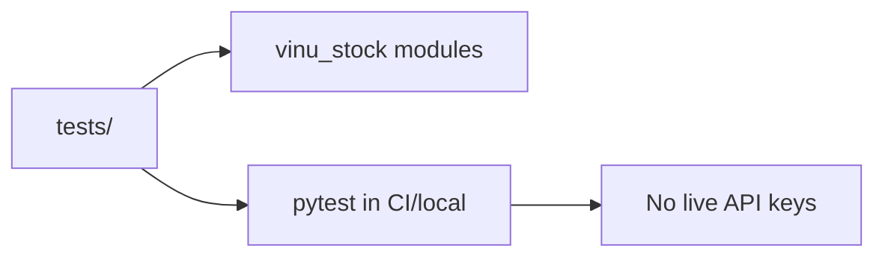

# Appendix C — Test Map

| Field | Value |
|-------|-------|
| **Package** | vinu-stock-price |
| **Module** | `tests/` |
| **Status** | REVIEW |
| **Verified** | 2026-07-01 |
| **Prerequisites** | Chapter 01 |

## Learning objectives

- Map every test file to the module and TASK it covers.
- Run the suite without live API keys.
- Know where to add tests for new features.

## 1. Problem this module solves

Contributors need a **single index** from `tests/test_*.py` to production modules. CI runs pytest with mocks and temp directories — no Polygon/Alpaca keys required. This appendix lists all **9 test files** and **20 test functions** in `vinu-stock-price/tests/`.

## 2. Position in pipeline



| Step | Input | Output |
|------|-------|--------|
| `pytest tests/ -v` | dev install | Pass/fail per module |
| Mock fixtures | JSON / monkeypatch | Provider isolation |
| `tmp_path` | pytest | Temp Parquet + meta.db |

## 3. File map

| File | Responsibility |
|------|----------------|
| `tests/test_catalog.py` | CatalogStore CRUD |
| `tests/test_parquet_io.py` | Write/read/dedupe |
| `tests/test_aggregate.py` | Interval aggregation |
| `tests/test_providers_mock.py` | Yahoo parse + registry fallback |
| `tests/test_api.py` | FastAPI TestClient |
| `tests/test_provider_retry.py` | HTTP retry (TASK-S03) |
| `tests/test_gap_validation.py` | Session gaps (TASK-S03) |
| `tests/test_indicators.py` | Indicators + adjust (TASK-S01/S02) |
| `tests/test_watchlist_sync.py` | Shared JSON (TASK-X01) |

## 4. Data contracts

### Test inventory

| Test file | Test function | Module under test | TASK |
|-----------|---------------|-------------------|------|
| `test_catalog.py` | `test_catalog_upsert_and_jobs` | `catalog/store.py` | — |
| `test_parquet_io.py` | `test_write_and_read_dedupe` | `storage/parquet.py` | — |
| `test_aggregate.py` | `test_bucket_ts` | `query/aggregate.py` | — |
| `test_aggregate.py` | `test_aggregate_1m_to_5m` | `query/aggregate.py` | — |
| `test_providers_mock.py` | `test_parse_yahoo_chart` | `providers/yahoo.py` | — |
| `test_providers_mock.py` | `test_registry_fallback_to_yahoo` | `providers/registry.py` | — |
| `test_providers_mock.py` | `test_yahoo_provider_configured` | `providers/yahoo.py` | — |
| `test_api.py` | `test_health` | `server/app.py` | — |
| `test_api.py` | `test_candles_1m` | `query/engine.py` | — |
| `test_api.py` | `test_candles_5m_aggregate` | `query/aggregate.py` | — |
| `test_api.py` | `test_catalog` | `catalog` + routes | — |
| `test_api.py` | `test_ui_page` | `server/static` | — |
| `test_api.py` | `test_health_providers` | `providers/registry.py` | — |
| `test_provider_retry.py` | `test_http_get_with_retry_succeeds_after_transient` | `providers/retry.py` | S03 |
| `test_gap_validation.py` | `test_count_session_gaps_zero_for_consecutive` | `catalog/gap_validation.py` | S03 |
| `test_gap_validation.py` | `test_count_session_gaps_detects_missing` | `catalog/gap_validation.py` | S03 |
| `test_indicators.py` | `test_parse_indicator_names` | `query/indicators.py` | S01 |
| `test_indicators.py` | `test_apply_sma_and_rsi` | `query/indicators.py` | S01 |
| `test_indicators.py` | `test_apply_adjusted_prices` | `query/indicators.py` | S02 |
| `test_watchlist_sync.py` | `test_write_and_read_shared` | `watchlist/shared.py` | X01 |
| `test_watchlist_sync.py` | `test_sync_from_shared_merges` | `watchlist/shared.py` | X01 |

### Coverage gaps (no dedicated test yet)

| Module | Suggested test |
|--------|----------------|
| `providers/polygon.py` | Mock HTTP aggs response |
| `providers/alpaca.py` | Mock bars pagination |
| `live/ingest_cycle.py` | Closed-bar filter unit test |
| `backfill/orchestrator.py` | End-to-end with mocks |

## 5. Logic (step by step)

1. `cd vinu-stock-price && pip install -e ".[dev]"`.
2. `pytest tests/ -v` — all tests use temp dirs or mocks.
3. On failure, use table above to find owning module chapter.
4. Integration with real keys: manual `vinu-stock-backfill` (not CI).

## 6. Configuration

| Key | YAML/env | Default | Effect |
|-----|----------|---------|--------|
| — | — | — | Tests do not read `.env` keys for providers |
| `tmp_path` | pytest fixture | per test | Isolated Parquet |

## 7. Worked examples

### Example A — happy path (full suite)

```bash
cd vinu-stock-price
pip install -e ".[dev]"
pytest tests/ -v
```

### Example B — edge case (single TASK-S03 file)

```bash
pytest tests/test_provider_retry.py tests/test_gap_validation.py -v
```

### Example C — API tests only

```bash
pytest tests/test_api.py -v
```

## 8. API / CLI (if applicable)

| Method | Path / Command | Params | Response |
|--------|----------------|--------|----------|
| — | `pytest tests/ -v` | — | Exit code 0 = pass |
| — | `pytest tests/test_api.py::test_health` | — | Single test |

## 9. SQL / queries (if applicable)

Tests create SQLite catalog in `tmp_path`; no manual SQL required. Example assertion pattern in `test_catalog.py`:

```python
store.upsert_symbol("AAPL", backfill_status="partial")
assert store.get_symbol("AAPL").backfill_status == "partial"
```

## 10. Tests

| Test file | Asserts |
|-----------|---------|
| All files in table §4 | See inventory |

## 11. Troubleshooting

| Symptom | Likely cause | Fix |
|---------|--------------|-----|
| `ModuleNotFoundError: vinu_stock` | Not installed editable | `pip install -e ".[dev]"` |
| DuckDB errors on Windows | Path separators | Tests use `tmp_path` — report bug |
| API test 404 | Fixture data missing | Check `test_api.py` sample parquet setup |
| Flaky Yahoo test | Network if mock removed | Keep mocks in `test_providers_mock.py` |

## 12. Fincept / reference repo mapping

| vinu-stock-price | Reference |
|------------------|-----------|
| Mock provider JSON | Fincept broker mock pattern |
| TestClient API | vinu-news `tests/test_api.py` |
| TASK columns | enhancement-doc1 traceability |

## 13. Related chapters

- [Chapter 03 — Providers](../part-1-providers/ch03-provider-architecture.md)
- [Chapter 16 — Retry & Gaps](../part-3-ingest/ch16-retry-gap-validation.md)
- [Chapter 19 — Indicators](../part-4-query/ch19-indicators.md)
- [Chapter 25 — Shared Watchlist](../part-5-operations/ch25-watchlist-shared.md)
- [Appendix B — Troubleshooting](apx-b-troubleshooting.md)
