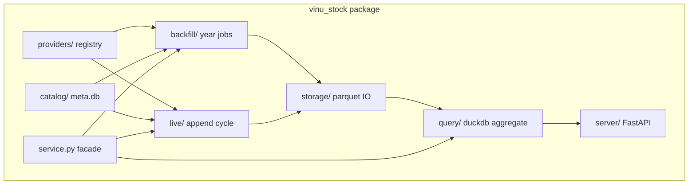

# Complete Guide — Stock Price (vinu-stock-price)

End-to-end reference for the **vinu-stock-price** package: Parquet OHLCV storage, provider registry, backfill + live ingest, DuckDB query API, and Docker deployment.

Related docs:

- [How to use (practical guide)](../how-to/README.md)
- Sibling package: [vinu-news](../../vinu-news/)

---

## Implementation status

**MVP implemented.** This document describes the design and maps to the current codebase under [`vinu_stock/`](../vinu_stock/). All planned v1 modules (providers, backfill, live, query, server, CLI, tests) are in place.

---

## Goals

- Top-level folder [`vinu-stock-price/`](../) beside [`vinu-news`](../../vinu-news/), same installable-package pattern.
- **Store 1m bars only** in Parquet; serve 5m/15m/1h/1d by aggregating at query time.
- **Backfill** from earliest available per symbol; **live** append for watchlist symbols.
- **Pluggable providers** (Polygon, Alpaca, Yahoo) with **configurable priority/order** — not hardcoded to one vendor.
- Full MVP: scaffold, meta catalog, backfill, live ingest, HTTP API, CLI, tests.

---

## Architecture (6 pillars → package modules)



| Pillar | vinu-news analog | vinu-stock-price module |
|--------|------------------|-------------------------|
| Provider registry | `rss/config/feeds.yaml` + fetch | [`providers/registry.py`](../vinu_stock/providers/registry.py) + [`providers/config/providers.yaml`](../vinu_stock/providers/config/providers.yaml) |
| Catalog / maintenance | `analysis/storage/schema.sql` | [`catalog/schema.sql`](../vinu_stock/catalog/schema.sql) + [`catalog/store.py`](../vinu_stock/catalog/store.py) (`meta.db`) |
| Ingestion | `rss/orchestration/` | [`backfill/`](../vinu_stock/backfill/) + [`live/`](../vinu_stock/live/) |
| Bar storage | SQLite articles | [`storage/parquet.py`](../vinu_stock/storage/parquet.py) (archive + live paths) |
| Query | `repository.py` + FTS | [`query/engine.py`](../vinu_stock/query/engine.py) (DuckDB over parquet globs) |
| API / CLI | `server/` + `cli.py` | same pattern, port **8081** |

---

## Directory layout

```
vinu-stock-price/
├── pyproject.toml
├── README.md
├── .env.example
├── Dockerfile
├── docker-compose.yml
├── docs/
│   ├── README.md
│   └── complete_guide_stock_price.md
├── how-to/
│   └── README.md
├── tests/
│   ├── test_catalog.py
│   ├── test_parquet_io.py
│   ├── test_aggregate.py
│   ├── test_providers_mock.py
│   └── test_api.py
└── vinu_stock/
    ├── __init__.py
    ├── cli.py
    ├── config.py
    ├── service.py
    ├── providers/
    │   ├── base.py
    │   ├── registry.py
    │   ├── config/providers.yaml
    │   ├── polygon.py
    │   ├── alpaca.py
    │   └── yahoo.py
    ├── catalog/
    │   ├── schema.sql
    │   └── store.py
    ├── storage/
    │   ├── paths.py
    │   ├── models.py
    │   ├── parquet.py
    │   └── backend.py
    ├── backfill/
    │   ├── orchestrator.py
    │   └── year_job.py
    ├── live/
    │   └── ingest_cycle.py
    ├── query/
    │   ├── aggregate.py
    │   └── engine.py
    ├── watchlist/
    ├── settings/
    └── server/
        ├── app.py
        ├── schemas.py
        ├── routes_read.py
        └── routes_config.py
```

**On-disk data** (not in git; Docker volume / `VINU_STOCK_DATA_ROOT`):

```
data/
├── meta.db
└── prices/1m/{SYMBOL}/
    ├── archive/{YYYY}.parquet
    └── live/{YYYY}.parquet
```

---

## Provider registry (reorderable)

[`vinu_stock/providers/config/providers.yaml`](../vinu_stock/providers/config/providers.yaml) — same idea as [`vinu-news/vinu_news/rss/config/feeds.yaml`](../../vinu-news/vinu_news/rss/config/feeds.yaml):

```yaml
providers:
  - id: polygon
    enabled: true
    priority: 1
    roles: [backfill, live]
  - id: alpaca
    enabled: true
    priority: 2
    roles: [live, backfill]
  - id: yahoo
    enabled: true
    priority: 99
    roles: [fallback]
```

- **`priority`**: lower number = tried first for backfill year fetches.
- **`roles`**: `backfill` | `live` | `fallback` — orchestrator filters by role.
- **Fallback chain**: if primary returns empty/error for a year, try next enabled provider with `fallback` or `backfill` role.
- **Per-symbol override** (optional future column in `symbol_catalog.preferred_provider`); v1 uses global order from YAML.

Credentials via `.env` (no secrets in yaml):

```
POLYGON_API_KEY=
ALPACA_API_KEY=
ALPACA_API_SECRET=
```

---

## Core data model

**BarRecord** (align with Fincept `BrokerCandle` + metadata) — see [`storage/models.py`](../vinu_stock/storage/models.py):

- `symbol`, `provider`, `bar_ts` (UTC epoch seconds, bar open)
- `open`, `high`, `low`, `close`, `volume`
- Optional: `vwap`, `trades`

**Dedup key**: `(symbol, provider, bar_ts)` on write.

**Catalog** (`symbol_catalog`) — see [`catalog/schema.sql`](../vinu_stock/catalog/schema.sql):

- `first_bar_ts`, `last_bar_ts`, `backfill_status` (`pending|partial|complete`)
- `archive_through` (last frozen year), `live_file` path

---

## Flows

### Backfill (on watchlist add or `POST /backfill/trigger`)

1. For each watchlist symbol, discover start: call `earliest_available()` on providers in priority order.
2. Queue `backfill_jobs` per `(symbol, year)` from first year → last complete year.
3. For each job: try providers in order → write `archive/{year}.parquet` → update catalog.
4. Mark `backfill_status=complete` when all years done (live may still run).

Implementation: [`backfill/orchestrator.py`](../vinu_stock/backfill/orchestrator.py), [`backfill/year_job.py`](../vinu_stock/backfill/year_job.py).

### Live ingest (`vinu-stock-ingest --continuous`, default 60s)

1. Load watchlist + `symbol_catalog.last_bar_ts`.
2. For each symbol, use first enabled provider with `live` role (fallback on error).
3. Fetch from `(last_bar_ts - 180s)` to now; keep **closed** 1m bars only.
4. Append to `live/{current_year}.parquet`; update `last_bar_ts`.
5. Log row in `ingest_log`.

Implementation: [`live/ingest_cycle.py`](../vinu_stock/live/ingest_cycle.py).

### Query (`GET /candles/{symbol}`)

Params: `interval` (1m|5m|15m|30m|1h|4h|1d), `from`, `to`, optional `provider`.

1. DuckDB `read_parquet([archive/*.parquet, live/*.parquet])` filtered by `bar_ts`.
2. If `interval != 1m`, run aggregation in [`query/aggregate.py`](../vinu_stock/query/aggregate.py).
3. Return JSON via pydantic schemas ([`server/schemas.py`](../vinu_stock/server/schemas.py) `DataResponse` pattern).

Implementation: [`query/engine.py`](../vinu_stock/query/engine.py).

---

## Service facade

[`vinu_stock/service.py`](../vinu_stock/service.py) mirrors [`vinu-news/vinu_news/service.py`](../../vinu-news/vinu_news/service.py):

| NewsService | StockService |
|-------------|--------------|
| `run_ingestion_cycle()` | `run_live_cycle()` |
| `get_ticker_news()` | `get_candles(symbol, interval, from, to)` |
| watchlist CRUD | same |
| settings CRUD | same + `default_provider`, `data_root` |
| — | `run_backfill(symbols?, years?)` |
| — | `get_catalog(symbol?)` |

---

## CLI entry points

From [`pyproject.toml`](../pyproject.toml):

```toml
[project.scripts]
vinu-stock-backfill = "vinu_stock.cli:backfill_main"
vinu-stock-ingest   = "vinu_stock.cli:ingest_main"
vinu-stock-serve    = "vinu_stock.cli:serve_main"
vinu-stock-query    = "vinu_stock.cli:query_main"
```

- `vinu-stock-backfill AAPL [--from-year 2020] [--to-year 2025]`
- `vinu-stock-ingest --once | --continuous`
- `vinu-stock-serve` → port **8081**
- `vinu-stock-query candles AAPL --interval 5m --days 30`

---

## HTTP API (v1 routes)

| Method | Path | Purpose |
|--------|------|---------|
| GET | `/health` | data root, catalog stats |
| GET | `/catalog` | all symbols coverage |
| GET | `/catalog/{symbol}` | first/last bar, backfill status |
| GET | `/candles/{symbol}` | `interval`, `from`, `to`, `days`, `provider` |
| GET/POST/DELETE | `/watchlist/tickers` | same as vinu-news |
| GET/PATCH | `/settings` | poll interval, default provider, data root |
| POST | `/backfill/trigger` | backfill watchlist |
| POST | `/ingest/trigger` | one live cycle |

Interactive docs: http://127.0.0.1:8081/docs

Static web UI at `/ui` (Settings, Coverage, Prices): http://127.0.0.1:8081/ui — served from [`vinu_stock/server/static/index.html`](../vinu_stock/server/static/index.html), same pattern as vinu-news.

---

## Dependencies

```toml
dependencies = [
  "fastapi>=0.110",
  "uvicorn[standard]>=0.27",
  "pydantic>=2.0",
  "python-dotenv>=1.0",
  "requests>=2.31",
  "pyyaml>=6.0",
  "pyarrow>=15.0",
  "duckdb>=0.10",
]
dev = ["pytest>=8.0", "httpx>=0.27"]
```

Install: `pip install -e "./vinu-stock-price[dev]"`

---

## Docker

From [`docker-compose.yml`](../docker-compose.yml):

- **live-ingest**: `vinu-stock-ingest --interval 60`
- **api**: `vinu-stock-serve --host 0.0.0.0 --port 8081`
- Shared volume: `VINU_STOCK_DATA_ROOT=/data` (meta.db + parquet tree)
- Backfill: manual `docker compose run --rm api vinu-stock-backfill AAPL --from-year 2023` (heavy; not auto on boot)

---

## Tests (no live API keys in CI)

```bash
cd vinu-stock-price
pytest tests/ -v
```

- **Unit**: parquet write/read/dedupe, aggregate 1m→5m, catalog CRUD.
- **Provider mocks**: fixture JSON for yahoo parser + registry fallback.
- **API**: TestClient with temp data dir + sample parquet files.
- **Integration** (optional local): run backfill with real API keys manually.

---

## Out of scope for v1 (explicit)

- Fincept-style 22 brokers / WebSocket union / DataHub
- Storing multiple intervals on disk
- Separate SQLite table per symbol
- Postgres backend
- Year-end archive rollover job (documented; implement as fast follow)

---

## Reference files (patterns)

| Topic | Path |
|-------|------|
| Env loading | [`vinu-news/vinu_news/config.py`](../../vinu-news/vinu_news/config.py) |
| CLI | [`vinu-news/vinu_news/cli.py`](../../vinu-news/vinu_news/cli.py) |
| FastAPI factory | [`vinu_stock/server/app.py`](../vinu_stock/server/app.py) |
| Watchlist CRUD | [`vinu_stock/watchlist/store.py`](../vinu_stock/watchlist/store.py) |
| Fincept OHLCV shape | `FinceptTerminal/fincept-qt/src/trading/TradingTypes.h` (`BrokerCandle`) |
