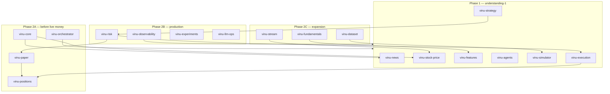

# Gaps & Phase 2 — Understanding 2

Honest assessment of what [`understanding-1.md`](understanding-1.md) covers vs what is still missing for a full **advanced AI trading system**, plus proposed **future components** to close those gaps.

**Prerequisite:** Read [`understanding-1.md`](understanding-1.md) first — it defines the core architecture (data → intelligence → strategy → execution).

---

## Executive summary

| Ambition | Is understanding-1 enough? |
|----------|----------------------------|
| **Tier A** — Personal research AI trading stack | **Mostly yes** — build the planned components |
| **Tier B** — Paper → small live equity bot | **Mostly yes** — add paper engine, post-trade risk, unified config |
| **Tier C** — Production institutional-grade system | **No** — requires Phase 2 infra, MLOps, compliance, alt data |

The current plan covers roughly **70–80% of the architecture** for an AI-assisted **equity** stack (news + prices → features + LLM → strategy → sim → broker). It is the right **Phase 1** skeleton. Phase 2 closes production, real-time, and governance gaps.

---

## What Phase 1 covers well

For the Fincept lifecycle + AI4Finance blueprint, the map in understanding-1 is **coherent at the conceptual level**:

| Layer | Component(s) | Lifecycle step |
|-------|--------------|----------------|
| Unstructured data | `vinu-news`, `vinu-agents` | Step 1 / 1.1 |
| Structured market data | `vinu-stock-price` | Step 1 |
| Feature / alpha | `vinu-features` | Step 3 |
| AI text intelligence | `vinu-agents` | Step 4 (qualitative input) |
| Decision fusion | `vinu-strategy`, `vinu-correlation` | Step 4 |
| Realistic evaluation | `vinu-simulator` | Pre-live validation |
| Live actuation | `vinu-execution` | Step 5 |
| Event wiring | `vinu-bus` | Step 2 |

**Phase 1 goal:** Combine news sentiment + technical features + LLM reasoning, backtest with friction, then paper/live trade via Alpaca.

---

## Partially covered gaps

These are mentioned lightly or as “optional” in understanding-1, but matter for *advanced* AI trading.

### 1. “AI” beyond LLM + optional LightGBM

**In plan:**

- Rule-based news (`vinu-news`)
- LLM structured JSON (`vinu-agents`)
- Optional classical ML (qlib-style in `vinu-features`)

**Still thin:**

- DRL training pipelines (FinRL-Meta trainers deliberately skipped)
- Model registry, scheduled retraining, drift detection
- Walk-forward validation and ensemble governance at scale

**Implication:** “AI advanced” in Phase 1 means **LLM + quant features**, not a full self-learning agent farm.

---

### 2. Real-time / low-latency trading

**In plan:**

- `vinu-stock-price` — 1m OHLCV, polling-based live ingest, Parquet archive

**Still thin:**

- WebSocket tick streams
- Order book / L2 data
- Sub-minute decision loops

**Implication:** Architecture is **research- and swing/daily-grade**, not latency-grade. Fincept Step 1 originally assumed live streaming — that path is not in Phase 1.

---

### 3. Post-trade risk (not just pre-trade)

**In plan:**

- Pre-trade checks in `vinu-execution` (max position, stop-loss bounds, cash floor)
- Weight-centric rebalance

**Still thin (Fincept Step 5 has these explicitly):**

- Open position monitoring after fill
- Trailing stop / take-profit automation
- Portfolio drawdown kill switch
- Sector exposure, correlation limits, VaR-style caps

**Implication:** Pre-trade gate exists in the design; **active position management** does not.

---

### 4. Paper trading as a first-class mode

**In plan:**

- `vinu-simulator` — historical backtest with slippage
- `vinu-execution` — live broker bridge

**Missing middle layer:**

- **Live paper engine** — match orders against current bid/ask in real time (Fincept `PaperTrading.cpp` pattern)
- Same strategy code path as live, different fill simulator

**Implication:** Jump from backtest → live is risky without a dedicated paper stage.

---

### 5. Unified platform concerns

**In plan:**

- Separate installable packages (`vinu-news`, `vinu-stock-price`, …)

**Still thin:**

- Two watchlists, two storage backends (SQLite vs Parquet + meta.db)
- No shared symbol master or global audit log
- No single orchestrator (“run full pipeline daily”)

**Implication:** Works for modular development; needs **`vinu-core`** before production ops.

---

## Gaps not in Phase 1 at all

Required for many **production** advanced trading systems; absent from understanding-1:

| Gap | Why it matters |
|-----|----------------|
| **Fundamental / alt data** | Earnings, SEC filings, macro, options flow — only optional via `vinu-filings` / `vinu-research` |
| **Multi-asset** | Crypto, futures, options — FinRL-Meta has envs; Vinu stack is equity-centric |
| **Corporate actions / survivorship** | Splits, dividends, delistings — backtest bias without handling |
| **Observability** | Alerts, dashboards, trade audit trail, compliance logs |
| **LLM ops** | Cost caps, latency SLAs, fallback when API fails, hallucination guards |
| **Security / secrets** | Beyond `.env` — rotation, vault, scoped broker tokens |
| **Experiment tracking** | Which model/version/strategy produced which live weights |
| **Regulatory guardrails** | PDT, wash sales, max daily loss (US retail) |
| **UI / operator console** | Deferred in vinu-news docs — fine for research, weak for ops |
| **Integration / E2E tests** | Per-component tests exist; full pipeline tests not planned |

---

## Future components (Phase 2)

Proposed packages to close the gaps above. Build these **after** Phase 1 core components are working.

### Priority A — Required before real capital (Tier B)

| Component | Closes gap | What to build |
|-----------|------------|---------------|
| **`vinu-paper`** | Paper trading gap | Real-time paper matcher; same weight contract as `vinu-execution`; fill against live quotes without broker orders |
| **`vinu-positions`** | Post-trade risk | Open P&L, trailing stops, take-profit, drawdown monitor; Fincept `PositionManager` pattern |
| **`vinu-core`** | Unified platform | Shared watchlist, symbol catalog, global config, cross-package settings bridge |
| **`vinu-orchestrator`** | Pipeline automation | Daily job: ingest news + prices → features → agents → strategy → sim or paper; single CLI / cron entry |

---

### Priority B — Production hardening (Tier C)

| Component | Closes gap | What to build |
|-----------|------------|---------------|
| **`vinu-observability`** | Ops / audit | Structured logs, alert hooks (email/Slack), trade audit DB, health endpoints per service |
| **`vinu-experiments`** | Model lifecycle | Strategy/model versioning, walk-forward result store, “which config is live” registry |
| **`vinu-risk`** | Portfolio risk | Sector caps, correlation limits, daily loss kill switch, max leverage; sits between strategy and execution |
| **`vinu-llm-ops`** | LLM reliability | Rate limits, cost budgets, cache TTL policy, fallback to rule-based sentiment when LLM down |

---

### Priority C — Data & scope expansion

| Component | Closes gap | What to build |
|-----------|------------|---------------|
| **`vinu-fundamentals`** | Alt / fundamental data | FMP-style income/balance/cash flow; earnings calendar; point-in-time joins (FinRobot `finrobot_equity` path) |
| **`vinu-filings`** | SEC / regulatory text | Filing fetch, PDF/text parse, link to `vinu-agents` for deep analysis |
| **`vinu-stream`** | Real-time data | WebSocket ingest, optional tick/L2; extends or wraps `vinu-stock-price` live path |
| **`vinu-dataset`** | Backtest integrity | Corporate actions, survivorship-safe panels, point-in-time feature joins (qlib `dataset` ideas) |
| **`vinu-backtest`** | Research rigor | Rolling backtest, benchmark comparison, attribution — may merge with or extend `vinu-simulator` |

---

### Priority D — Optional / later

| Component | Closes gap | What to build |
|-----------|------------|---------------|
| **`vinu-research`** | Equity research reports | Multi-agent HTML/PDF reports (FinRobot Pro pipeline) |
| **`vinu-portfolio-env`** | RL / optimization research | Markowitz-style env from FinRL-Meta — only if pursuing DRL |
| **`vinu-ui`** | Operator console | Unified dashboard: news, prices, signals, positions, P&L |
| **`vinu-multi-asset`** | Asset class expansion | Crypto / futures adapters — separate from equity pipeline |

---

## Phase 2 architecture (target)

---

## Recommended path by tier

### Tier A — Personal research (current target)

**Build from understanding-1 only:**

1. `vinu-features`
2. `vinu-agents`
3. `vinu-correlation`
4. `vinu-strategy`
5. `vinu-simulator`

Stop before live execution until backtests are trustworthy.

---

### Tier B — Paper → small live equity

**Add Phase 2A before first live order:**

1. `vinu-core` — one watchlist, one config
2. `vinu-orchestrator` — repeatable daily pipeline
3. `vinu-paper` — validate fills and latency in real time
4. `vinu-positions` — trailing stops, open risk
5. Then `vinu-execution` with strict daily loss limits

---

### Tier C — Production-grade

**Add Phase 2B + selective 2C:**

1. `vinu-risk` — portfolio-level gates
2. `vinu-observability` — audit every order and signal
3. `vinu-experiments` — version everything that touches live weights
4. `vinu-llm-ops` — production LLM SLOs
5. `vinu-dataset` + `vinu-fundamentals` — if strategy uses fundamentals or long backtests

---

## Master checklist (Phase 1 + Phase 2)

| Component | Phase | Status | Closes |
|-----------|-------|--------|--------|
| vinu-news | 1 | ✓ Built | Unstructured data |
| vinu-stock-price | 1 | ✓ Built | OHLCV data |
| vinu-features | 1 | Not built | Indicators / alpha |
| vinu-agents | 1 | Not built | LLM intelligence |
| vinu-correlation | 1 | Not built | News ↔ price join |
| vinu-strategy | 1 | Not built | Decision fusion |
| vinu-simulator | 1 | Not built | Realistic backtest |
| vinu-execution | 1 | Not built | Live broker |
| vinu-bus | 1 | Not built | Event routing |
| vinu-core | 2A | Not built | Unified config / watchlist |
| vinu-orchestrator | 2A | Not built | Pipeline automation |
| vinu-paper | 2A | Not built | Live paper trading |
| vinu-positions | 2A | Not built | Post-trade risk |
| vinu-risk | 2B | Not built | Portfolio risk overlay |
| vinu-observability | 2B | Not built | Ops / audit |
| vinu-experiments | 2B | Not built | Model / strategy versioning |
| vinu-llm-ops | 2B | Not built | LLM production ops |
| vinu-fundamentals | 2C | Not built | Fundamental data |
| vinu-filings | 2C | Not built | SEC text |
| vinu-stream | 2C | Not built | Real-time ticks |
| vinu-dataset | 2C | Not built | Backtest data integrity |
| vinu-backtest | 2C | Not built | Research metrics |
| vinu-research | 2D | Not built | Equity reports |
| vinu-ui | 2D | Not built | Operator dashboard |

---

## What not to over-build early

| Temptation | Better approach |
|------------|-----------------|
| Clone full qlib | Extract feature matrix + time splits only |
| Full FinRobot agent platform | Prompt templates + JSON schema in `vinu-agents` |
| FinRL-Meta RL trainers | `vinu-simulator` cost model first; RL only if needed |
| WebSocket ticks on day one | 1m OHLCV is enough for swing/daily strategies |
| Unified UI before pipeline works | CLI + orchestrator first; `vinu-ui` last |

---

## One-line summary

**Understanding-1 is Phase 1** — the right skeleton for research and AI-augmented equity strategies. **This document is Phase 2** — paper engine, position management, unified core, observability, and data integrity close the gaps before calling the system production-ready.

---

## Next document

When scoping a specific Phase 2 component (e.g. `vinu-paper` API and folder layout), add `understanding-3-<component>.md` with implementation spec.
