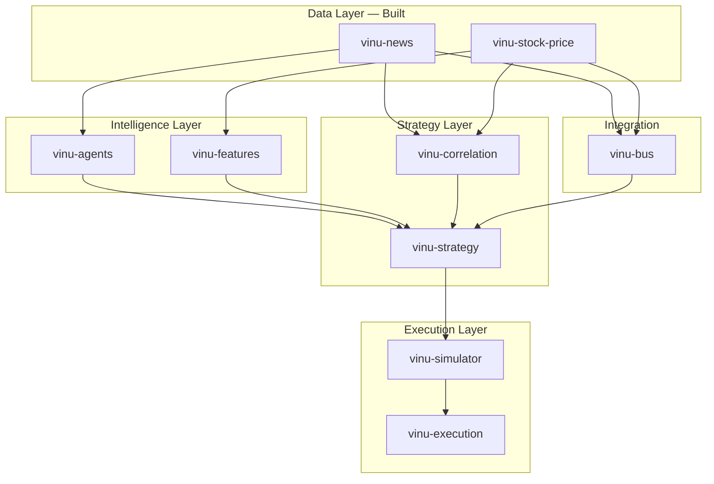
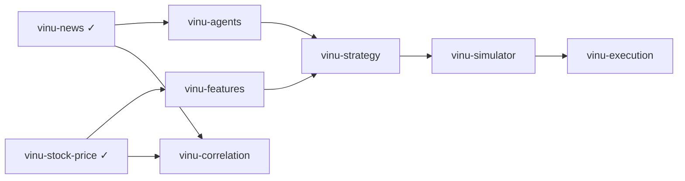

# Understanding 1 — Vinu Component Architecture Map

High-level analysis of what to build next, mapped from four reference repositories into proprietary `vinu-*` components.

**Related docs:**

- [`new_level_of_research/new_repos_and_some_understanding.md`](../new_level_of_research/new_repos_and_some_understanding.md) — original AI4Finance blueprint
- [`vinu-news/README.md`](../vinu-news/README.md) — news ingestion + rule-based enrichment
- [`vinu-stock-price/README.md`](../vinu-stock-price/README.md) — OHLCV archive, live ingest, query API
- [`vinu-features/README.md`](../vinu-features/README.md) — preset blueprints, job registry, feature run artifacts (v1)
- [`personal_understanding/stock_analysis_lifecycle.md`](../personal_understanding/stock_analysis_lifecycle.md) — Fincept Steps 1–5 lifecycle
- [`understanding-3-data-enhancements.md`](understanding-3-data-enhancements.md) — **Next:** HIGH-priority data layer tasks for vinu-news + vinu-stock-price

---

## Design principle

Extract **design patterns**, not entire repositories. Cloning full frameworks introduces boilerplate, broken dependencies, and formats that do not fit the Vinu pipeline. Each reference repo contributes one architectural idea that becomes a focused, installable component.

---

## What is already built

| Component | Role | Maps to |
|-----------|------|---------|
| **vinu-news** | RSS ingest → rule enrichment → dedup → story threads → FTS | FinRobot news side + Fincept Step 1 / 1.1 |
| **vinu-stock-price** | 1m OHLCV → Parquet archive + live + catalog + query API | qlib / FinRL data layer (price only) |

Together these are the **two data pillars**: unstructured text and structured market prices.

---

## The four core components (from reference repos)

These are the main packages implied by the AI4Finance blueprint — one per reference repository.

### 1. `vinu-features` — from `microsoft/qlib`

**Motive:** High-performance tabular feature extraction and alpha generation.

**Core idea to extract:** The **Multi-Factor Data Adapter** — not qlib’s binary format.

**What to build:**

- Rolling technical factors (MA, RSI, volatility, volume ratios)
- Expression-style feature definitions (OHLCV → normalized feature matrix)
- Train / valid / test time splits to prevent look-ahead bias
- Optional: alpha scoring / ML forecast layer (LightGBM, etc.)

**Inputs:** `vinu-stock-price` candles  
**Outputs:** Feature tables per symbol / date for strategies  
**Suggested layout:** `vinu_features/engine.py` (or `core/features/engine.py` inside a package)

**Reference paths in qlib:**

- Data handlers and feature wrappers under `qlib/data/`
- Workflow configs under `examples/benchmarks/`

---

### 2. `vinu-agents` — from `AI4Finance-Foundation/FinRobot`

**Motive:** Unify unstructured financial text with structured decision-making via multi-agent LLM reasoning.

**Core idea to extract:** **Chain-of-Thought (CoT) News Routing** — distinct from vinu-news’s rule-based enrichment.

**What to build:**

- CoT prompt templates → structured JSON output:
  - Sentiment score `[-1.0, +1.0]`
  - Confidence interval `[0, 100%]`
  - Market risk indicators
- On-demand article analysis with URL cache in DB
- Market digest / ticker daily summary agents
- Optional later: equity research agents (FMP fundamentals, DCF, HTML reports from `finrobot_equity/`)

**Inputs:** `vinu-news` articles  
**Outputs:** Structured LLM vectors strategies can consume  
**Suggested layout:** `vinu_agents/sentiment_analyst.py`

**Reference paths in FinRobot:**

- `finrobot/agents/workflow.py`
- `finrobot/agents/prompts.py`
- `finrobot_equity/` for full equity research pipeline

**Note:** vinu-news is ~92% complete on rule-based Step 1. LLM layers are the remaining intelligence gap — see [`vinu-news/docs/news_componete_still_missing.md`](../vinu-news/docs/news_componete_still_missing.md).

---

### 3. `vinu-simulator` — from `AI4Finance-Foundation/FinRL-Meta`

**Motive:** Realistic backtest environment that prevents standard backtesting bugs and data leakage.

**Core idea to extract:** **Slippage and transaction modeling** in a Gymnasium-style env.

**What to build:**

- `reset()` / `step()` market simulator
- Slippage + commission overlay (0.05%–0.1% typical)
- Position / cash accounting; no hyper-trading artifacts
- Train vs test vs trade pipeline separation (FinRL-Meta DataOps idea)

**Inputs:** `vinu-stock-price` + target weights from a strategy  
**Outputs:** Realistic P&L, drawdown, trade log  
**Suggested layout:** `vinu_simulator/market_simulator.py`

**Reference paths in FinRL-Meta:**

- `meta/env_stock_trading/` — stock trading environments
- `meta/env_portfolio_optimization/` — portfolio optimization env
- `meta/data_processor.py` — multi-source normalization patterns

---

### 4. `vinu-execution` — from `AI4Finance-Foundation/FinRL-Trading` (FinRL-X)

**Motive:** Translate model predictions into safe portfolio allocations and live broker orders.

**Core idea to extract:** The **Weight-Centric Portfolio Contract**.

**What to build:**

- Strategies output **target weights** (e.g. `[AAPL: 0.20, TSLA: 0.00, CASH: 0.80]`) — not raw buy/sell signals
- Pre-trade risk layer (max position, stop-loss, cash floor)
- Rebalance diff: current holdings → orders
- Broker bridge (Alpaca first; already used in vinu-stock-price)
- Performance / P&L tracking

**Inputs:** Strategy weights + live prices + optional news risk flags  
**Outputs:** Safe orders to broker API  
**Suggested layout:** `vinu_execution/broker_bridge.py`

**Reference paths in FinRL-Trading:**

- `src/trading/trade_executor.py`
- `src/trading/alpaca_manager.py`
- `src/strategies/base_strategy.py` — weight-centric pipeline

**FinRL-X weight pipeline:**

```
w_t = R_t( T_t( A_t( S_t( X_≤t ) ) ) )
```

Where:

- **S** — stock selection
- **A** — portfolio allocation
- **T** — timing adjustment
- **R** — portfolio-level risk overlay

Each stage is swappable without breaking the contract between strategy and execution.

---

## Extra components (optional, per repo)

Smaller extractable pieces beyond the four core packages:

| Repo | Possible component | What it adds |
|------|-------------------|--------------|
| **qlib** | `vinu-backtest` | Rolling backtest, benchmark comparison, portfolio metrics |
| **qlib** | `vinu-dataset` | Point-in-time datasets, leakage-safe joins |
| **FinRobot** | `vinu-filings` | SEC filing fetch + PDF/text for deep analysis |
| **FinRobot** | `vinu-research` | Multi-agent equity report generator (HTML/PDF) |
| **FinRL-Meta** | `vinu-portfolio-env` | Portfolio optimization env (Markowitz-style) |
| **FinRL-Meta** | `vinu-data-normalizer` | Multi-source OHLCV → unified schema (partial overlap with vinu-stock-price) |
| **FinRL-Trading** | `vinu-strategy` | Weight pipeline: selection → allocation → timing → risk |
| **FinRL-Trading** | `vinu-signals` | ML stock selection (Random Forest pattern in `ml_strategy.py`) |

---

## Glue components (Fincept lifecycle, not from the 4 repos)

Integration layer between data and execution — from [`personal_understanding/stock_analysis_lifecycle.md`](../personal_understanding/stock_analysis_lifecycle.md):

| Step | Suggested component | Purpose |
|------|---------------------|---------|
| Step 1 / 1.1 | **vinu-news** ✓ | Ingestion + rule-based news analysis |
| Step 2 | **vinu-bus** | Pub/sub event routing (news event → strategy subscriber) |
| Step 3 | **vinu-features** | Indicators from OHLCV |
| Step 4 | **vinu-strategy** / **vinu-conditions** | Rules: e.g. HIGH impact + BULLISH news + RSI < 30 → weight bump |
| Step 5 | **vinu-execution** | Risk + order placement |
| Cross | **vinu-correlation** | Join news intensity vs price reaction |

---

## Full architecture map



---

## End-to-end data flow (target state)

```
[RSS / scrapers]          vinu-news
       ↓
[Rule enrich + threads]   sentiment, impact, tickers, FTS
       ↓
[LLM analyze optional]    vinu-agents  ← structured JSON vectors
       ↓
                              ↓
[OHLCV 1m Parquet]        vinu-stock-price
       ↓
[Feature matrix]          vinu-features  ← RSI, MA, alpha factors
       ↓
[Strategy rules]          vinu-strategy  ← target weights
       ↓
[Backtest with friction]  vinu-simulator  ← slippage, commission
       ↓
[Live rebalance]          vinu-execution  ← risk gate → Alpaca orders
```

---

## Suggested build order

Practical sequence given what already exists:



| Priority | Component | Why now |
|----------|-----------|---------|
| 1 | **vinu-features** | Unlocks quantitative strategies; uses vinu-stock-price directly |
| 2 | **vinu-agents** | LLM layer on vinu-news; FinRobot prompts only, not full install |
| 3 | **vinu-correlation** | Quick win — join story threads + candle moves |
| 4 | **vinu-strategy** | Weight-centric signal logic (FinRL-Trading pattern) |
| 5 | **vinu-simulator** | Backtest with friction before any live money |
| 6 | **vinu-execution** | Live / paper broker bridge |
| 7 | **vinu-bus** | Only when real-time event wiring is needed |

---

## What not to clone wholesale

| Skip cloning | Instead extract |
|--------------|-----------------|
| qlib binary data format | Feature matrix + time-split logic |
| FinRobot full agent platform | Prompt templates + JSON schema |
| FinRL-Meta RL trainers (ElegantRL, SB3) | `step()` env + cost model |
| FinRL-Trading entire stack | Weight contract + risk gate + Alpaca rebalance |

---

## Reference repository clone commands

```bash
# Feature & ML forecasting engine
git clone https://github.com/microsoft/qlib.git

# News & text analysis multi-agent platform
git clone https://github.com/AI4Finance-Foundation/FinRobot.git

# Production live-trading & risk vector engine
git clone https://github.com/AI4Finance-Foundation/FinRL-Trading.git

# Dataset middleware & simulator layer
git clone https://github.com/AI4Finance-Foundation/FinRL-Meta.git
```

Local copies in this workspace (when cloned):

- `new_level_of_research/qlib/`
- `FinRobot/`
- `FinRL-Trading/`
- `FinRL-Meta/`

---

## Component checklist

| Component | Status | Source repo | Depends on |
|-----------|--------|-------------|------------|
| vinu-news | ✓ Built | FinRobot / Fincept | — |
| vinu-stock-price | ✓ Built | qlib / FinRL data | — |
| vinu-features | ✓ v1 built | qlib | vinu-stock-price — see [vinu-features/README.md](../vinu-features/README.md) |
| vinu-agents | Not built | FinRobot | vinu-news |
| vinu-correlation | Not built | Cross-cutting | vinu-news, vinu-stock-price |
| vinu-strategy | Not built | FinRL-Trading | vinu-features, vinu-agents |
| vinu-simulator | Not built | FinRL-Meta | vinu-stock-price, vinu-strategy |
| vinu-execution | Not built | FinRL-Trading | vinu-simulator, broker API |
| vinu-bus | Not built | Fincept Step 2 | vinu-news, vinu-stock-price |

---

## One-line summary

**vinu-news** and **vinu-stock-price** are the data pillars. The four reference repos map to **vinu-features**, **vinu-agents**, **vinu-simulator**, and **vinu-execution**, with **vinu-strategy**, **vinu-correlation**, and **vinu-bus** as the glue between them.

---

## Next document

When a component is scoped in detail (folder layout, API surface, first milestone), add `understanding-2.md` for that component’s implementation spec.
